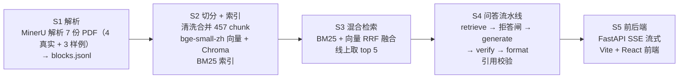

# 机械设备运维知识问答 RAG 平台

面向泵类设备维修手册的检索增强生成（RAG）问答系统：PDF 手册 → 解析切分 → 向量/BM25 混合检索 → 固定流水线（retrieve → 拒答闸 → generate → verify）→ 流式问答，每句回答标注出处，点开可核对手册原文。embedding 模型本地离线加载，生成调用 DeepSeek API；仅在开发环境验证。

## 关键结果

> 指标均可在 `eval/` 下复现，复现命令见「复现评测」。

- **混合检索选型**：36 题评测集上，BM25 + 向量 RRF 融合相比纯向量 Recall@1 0.583 → 0.778、MRR@10 0.720 → 0.836；线上取前 5 条，对应 Recall@5 0.861 → 0.889（[s3_summary](eval/reports/s3_summary.md)）
- **逐句引用标注**：同一份检索结果下只改提示词里的引用条款，无引用句占比 A 1.000 → B 0.732 → C 0.063，拒答率没有上升；C 组已上线。这个指标衡量的是「每句话有没有标出处」，不衡量出处是否真的支持这句话（[halluc_ab](eval/halluc_ab/summary.md)）
- **端到端耗时构成**：正常问答端到端均值 2724 ms，其中 LLM 生成占 99.2%，本地计算（混合检索、逐块距离、拒答闸）合计 22 ms；优化空间在生成侧（首 token P50 1666 ms）（[s5_perf](eval/reports/s5_perf.md)）
- **答案级评测基线**：150 题（带参考答案、关键事实，dev/test 划分）。测试集上应作答的 59 题完全答对 43 题（0.729），数值事实答对 32/35，应拒答的 14 题拒掉 13 题；只要证据被检索到且系统作答，就全部答对（43/43）——失分来自拒答闸误拒和检索未召回，不是生成（[方法与结果](docs/answer_eval.md)）

## 演示

<p align="center">
  
</p>

| 点击引用角标查看原文（表格按原结构还原） | 库外问题被拒答闸拦截，不调用大模型 |
|---|---|
|  |  |

> 一次提问的过程：先推送检索到的手册片段（手册名、章节、页码），再流式输出回答；回答里每句末尾的 chunk_id 渲染成可点击的角标，点开即可核对原文；最后给出引用校验结果与 token / 耗时。回答被生成长度上限截断时会显式提示。

## 使用场景

> 谁会用、怎么用。

现场维修人员遇到设备故障时，通常要翻几百页 PDF 手册才能找到某个参数或处置步骤；本系统把这个过程变成一次提问。

- 「防爆泵安装需遵守哪些指导原则？」→ 返回正文段落
- 「出水管径125时轴封水量是多少？」→ 返回表格中的对应行（0.20 m³/h）
- 「如何配置 Nginx 反向代理？」→ 被拒答闸拦截（最相近片段的向量距离 0.4334 > 阈值 0.3567），不调用大模型

知识库覆盖 7 个文档：4 份公开泵类手册 + 3 份自造样例手册（见「数据来源」）。拒答闸只能拦住与手册差得远的问题；「挖掘机液压泵压力多少正常？」这类语义相邻的库外问题（距离 0.3452）会穿过拒答闸，只能靠提示词要求模型回答「检索内容不足」来兜底，不保证每次都拒答（见「已知局限」）。

## 架构

> 五阶段数据流与拒答短路机制。



- **拒答闸**：检索完成后取向量 top-1 distance 与阈值 τ=0.3567 比较，超阈值直接返回「知识库无相关内容」，跳过生成与校验，不调用 LLM。
- **流水线实现**：[`src/s4_agent/graph.py`](src/s4_agent/graph.py) 用 LangGraph 定义了上面的流水线，命令行入口运行的是这张图；API（[`src/s5_app/api.py`](src/s5_app/api.py)）复用同一组节点函数和参数，但为了逐 token 推送，生成段改写成了流式调用，没有直接执行编译后的图。整条链路是固定流水线：没有工具调用，也不做多轮对话。
- **参数集中在 config**：线上用的提示词版本、检索条数、生成上限、拒答阈值都在 [`configs/config.yaml`](configs/config.yaml) 的 `s4_agent` 段；三版提示词存在 [`configs/prompts/`](configs/prompts/)，评测脚本读的是同一批文件。

## 核心数据

> 语料规模、评测集构成与三轮检索对比。

- **语料**：7 个文档 → 457 个 chunk（text 328 / table 129）：4 份公开泵类手册（439 条）+ 3 份自造样例手册（18 条，S1 阶段用于打通解析流程后保留在库）
- **评测集**：36 题（easy 14 / medium 17 / hard 5；text 29 / table 7），全部抽自真实手册 doc 1–4，不含样例手册，故检索指标不受样例数据影响
- **三轮检索对比**（36 题，最终采用混合检索；线上取 top 5，看 Recall@5 一行）：

| 指标 | 基线（纯向量） | 混合（BM25+向量） | 混合 + rerank | 最终采用 |
| --- | --- | --- | --- | --- |
| Recall@1 | 0.583 | **0.778** | 0.639 | 混合 |
| Recall@5 | 0.861 | **0.889** | 0.889 | 混合 |
| Recall@10 | 0.944 | 0.944 | 0.972 | 混合 |
| MRR@10 | 0.720 | **0.836** | 0.765 | 混合 |

- **端到端性能**（[s5_perf 实测](eval/reports/s5_perf.md)，C 组提示词、max_tokens=1024，正常路径 34 题）：端到端均值 2724 ms / P50 2398 ms，LLM 生成占 99.2%；输出 token P50 50、最大 409，34 题全部正常结束（finish_reason=stop），无截断；input 均值 1193 token，表格题 2258 明显高于正文题 917

## 引用标注：三组提示词对照实验

> 验证「哪种引用条款能让回答的每句话都标出处」，同时排除「靠多拒答换引用率」的伪改善。

### 实验设计

三组系统提示词仅差引用条款这一行，其余配置（LLM、temperature=0.0、top_k=5、检索缓存）完全相同：

| 组别 | 引用条款 | 文件 |
|---|---|---|
| A | 无引用标注要求（对照组） | [`configs/prompts/A_no_citation.txt`](configs/prompts/A_no_citation.txt) |
| B | 「答案末尾必须标注引用的 chunk_id」（切换前的线上版本） | [`configs/prompts/B_end_citation.txt`](configs/prompts/B_end_citation.txt) |
| C | 「答案每一句末尾必须标注所引用的 chunk_id」（现线上版本） | [`configs/prompts/C_per_sentence_citation.txt`](configs/prompts/C_per_sentence_citation.txt) |

三组共用同一份落盘检索缓存（36 题，top_k=5），保证检索输入完全一致，只换系统提示词；评测脚本在运行时自检三个文件确实只差这一行。

### 结果

| 组别 | 可打分题 | 实质句数 | 无引用句数 | 无引用句占比 | 拒答（闸/自述） | 拒答率 |
|---|---|---|---|---|---|---|
| A（无要求） | 33 | 133 | 133 | **1.000** | 2 / 1 | 0.083 |
| B（末尾标注） | 33 | 149 | 109 | **0.732** | 2 / 1 | 0.083 |
| C（逐句标注） | 34 | 126 | 8 | **0.063** | 2 / 0 | 0.056 |

> 「可打分题」指模型给出了实质性答案的题目；触发拒答闸或自述「检索内容不足」的题目不进入句级统计，故三组分母略有差异。无引用句占比为组内自比（无引用句数 ÷ 实质句数），不受分母差异影响。

### 怎么读这组数字

- **B 组残留 0.732 的根因**：B 组要求「答案末尾统一标注」，而评测口径按「句内或句尾含 chunk_id 标记」判定——两者天然错配，大部分句子被判为「无引用」。这不是模型不服从指令，而是条款与校验口径不一致；C 组把条款改成「每一句末尾标注」后降到 0.063（Δ −0.668）。
- **拒答率是控制变量**：若某组「引用率改善」是靠少答换来的，拒答率应同步上升。实测三组为 0.083 / 0.083 / 0.056——B 与 A 持平，C 比 A 低 2.8 个百分点，改善不来自「少答」。
- **这个指标不说明什么**：A 组没被要求标引用，得 1.000 是必然的；B → C 的下降本质上是指令遵循率的变化。句子带了 `[chunk_id]` 不代表那个片段真的支持这句话，也不代表答案正确——那需要答案级评测（参考答案、关键事实与数值核对），目前还没有。

线上用哪一版由 `configs/config.yaml` 的 `s4_agent.system_prompt` 决定，现为 C。

## 答案级评测

> 前面的评测只看检索命中和引用格式；这一节评「答得对不对」。方法、指标定义与完整结果见 [docs/answer_eval.md](docs/answer_eval.md)。

**评测集**（[`eval/answer_set.yaml`](eval/answer_set.yaml)）：150 题，121 题应作答（正文事实、步骤、表格、跨片段、口语化、多轮追问），29 题应拒答（相近领域、手册未写、无关问题）。每题有参考答案、关键事实和证据引文，经脚本校验数值出自手册原文；dev 77 题用于调试和迭代，test 73 题只用来报数。评测直接驱动线上接口背后的事件生成器，与线上同一条代码路径。

**基线**（C 组提示词、top_k=5、τ=0.3567；方括号为 95% 置信区间）：

| | dev | test |
|---|---|---|
| 应作答的题：完全答对 | 0.790（49/62）[0.67, 0.87] | 0.729（43/59）[0.60, 0.83] |
| 应作答的题：误拒（拒答闸 / 模型自述） | 10/62（9 / 1） | 14/59（10 / 4） |
| 数值事实答对 | 35/39 | 32/35 |
| 应拒答的题：被拒 | 15/15 | 13/14 |
| 忠实度（评审判为有依据，且摘抄的原文对得上） | 101/101 句 | 71/73 句 |
| 多轮追问：只发最后一句 → 改写成独立问题 | 0/5 → 4/5 | 0/5 → 3/5 |

关键事实、数值、拒答、证据命中由确定性代码判定；忠实度由评审模型逐句判定，并要求它摘抄原文、由代码核对。评审模型与生成模型相同，所以另做了灵敏度测试：往 dev 答案里注入改数字、换反义词、编造句三种错误，检出 40/40、29/30、52/52。**评测集和评审结果都还没有经过人工复核。**

从结果能看出的事：

- **生成不是瓶颈。** 证据全部召回且系统作答的题，全部完全答对（dev 49/49，test 43/43）；证据没召回全却作答的题，一道都没完全答对（0/3，0/2）。
- **拒答闸误拒是最大的失分项。** 证据已经检索到、却被闸拦掉的题，dev 6 道、test 10 道。单轮问题的误拒是 dev 4/57、test 5/54，闸距离大多只比 τ 高一点。
- **多轮追问不可用。** 10 道追问全部被拒答闸拦截；改写成独立问题后能答对 7 道。
- **错误的形态是「张冠李戴」，不是编造。** 答案句子与检索片段的字面重合度中位数 0.84–0.87，基本在摘抄原文。test 里漏拒的那道题，是用泵手册的换油周期回答了「减速机齿轮箱多久换油」。

```bash
python src/answer_eval/run.py            # 全量评测；加 --split dev 只看开发集，--reuse 用缓存零调用重算
python src/answer_eval/run.py --run v2   # 系统改动后换个名字另存，与 baseline 对比
```

## 关键取舍

> 每个技术决策的依据与代价。

1. **混合检索采用**。BM25 + 向量 RRF 融合：总体 R@1 0.583→0.778（+0.194）、MRR@10 0.720→0.836，table 的 R@1 0.143→0.429（翻三倍）。BM25 的字面匹配补上「问题 → 精确片段 / 表头 / 数字」的信号。

2. **rerank 弃用**。全局 CrossEncoder 精排把总体 R@1 从 0.778 打到 0.639（−0.139）；虽把 hard R@10 0.60→0.80、table R@10 0.714→0.857，但 7 条正文题被降权、单题 +3.07 s（36 题共 110.7 s）。text 占 29/36，全局精排净亏，脚本保留、config 置 `enabled: false`。

3. **拒答阈值重叠**。τ=0.3567 取自评测集 36 题向量 top-1 distance 的 P95，而负样本「挖掘机液压泵」distance 0.3347 已穿过阈值：语义邻近查询与正样本没有清晰间隔，单一距离闸挡不住。另外，τ 就是在这 36 题上标定的，线性插值下必然恰有 2 题（qa_002、qa_018）高于阈值，所以 2/36 的误拒是阈值定义决定的，不是在独立测试集上测出的误拒率；后来在答案级评测的新题上独立测得，单轮问题被闸误拒 dev 4/57、test 5/54。

4. **样例数据暂留在库**。457 chunk 中有 18 条来自 S1 阶段自造的样例手册；评测集 36 题全部抽自真实手册 doc 1–4，检索指标不受影响，前端来源卡片会把样例手册标为「示例」。清理需要改 `data/` 并重跑评测，尚未进行。另有一个 token 异常单例：qa_031 同时召回 5 个大表格 chunk，输入约 1 万 token，约为正常值 10 倍，已记录在 [`docs/badcase.md`](docs/badcase.md) 案例 9。

## 快速启动

> 装依赖、准备模型、建知识库、起服务。

### 1. 安装依赖

开发环境：Windows 11、Python 3.13、Node 18+，纯 CPU。

```bash
pip install -r requirements.txt
```

[`requirements.txt`](requirements.txt) 是应用与评测环境，版本均已锁定。S1 的 PDF 解析用 MinerU，它要求 transformers<5，与 sentence-transformers 6（要求 transformers>=5）冲突，需要另建环境安装 [`requirements-parse.txt`](requirements-parse.txt)；PDF 已解析过时用不到。

### 2. 准备模型

运行时只从本地加载模型（`local_files_only=True`），不会联网下载，需提前放到 `models/` 下（ModelScope 或 Hugging Face 任选）：

```bash
# embedding 模型（必需）
modelscope download BAAI/bge-small-zh-v1.5 --local-dir models/bge-small-zh-v1.5
# 或：hf download BAAI/bge-small-zh-v1.5 --local-dir models/bge-small-zh-v1.5

# rerank 模型（可选，只有 rerank 对照评测 src/s3_eval/rerank_retrieval.py 用到）
modelscope download BAAI/bge-reranker-base --local-dir models/bge-reranker-base
```

需要重新解析 PDF 时，在解析环境里执行 `mineru-models-download -s modelscope -m pipeline` 下载 MinerU 模型。

### 3. 构建知识库

PDF 与所有生成数据（`data/`、`chroma_db/`）不随仓库分发：把 4 份手册放进 `data/raw_pdf/` 并命名为 `1.pdf`–`4.pdf`（doc_id 取文件名，评测集的 gold chunk_id 依赖它）；3 份样例手册由 [`src/s1_ingest/_make_sample_pdfs.py`](src/s1_ingest/_make_sample_pdfs.py) 生成。然后一条命令完成 S1 解析 → S2 建索引：

```bash
python scripts/build_index.py --parse-python <解析环境的 python 路径>
```

[`scripts/build_index.py`](scripts/build_index.py) 依次执行 MinerU 解析 → 整理 blocks → 质检报告 → 清洗 → 切块 → 向量化（Chroma）→ BM25 索引，最后核对 chunks.jsonl、Chroma、BM25 三处的 chunk_id 是否一致。已解析过的 PDF 会自动跳过，此时不需要 `--parse-python`；只改了切块参数可以用 `--from chunks` 从中间开始。实测：从现有 MinerU 解析产物重建，blocks / chunks 文件与现有索引逐字节一致，向量与 BM25 索引完全相同。

### 4. 启动

```bash
# 配置 LLM key：复制 .env.example 为 .env，填入 DEEPSEEK_API_KEY

# 后端（FastAPI + SSE，端口 8000）
python -m uvicorn src.s5_app.api:app --host 127.0.0.1 --port 8000

# 前端（Vite + React，端口 5173，/api 自动代理到 http://localhost:8000）
cd frontend
npm install
npm run dev
```

接口：`GET /api/health`（健康检查与文档清单）、`POST /api/ask`（SSE 流式问答）、`GET /api/chunks/{chunk_id}`（片段原文）。

### 复现评测

| 报告 | 命令 | 是否调用 LLM |
|---|---|---|
| [s3_baseline](eval/reports/s3_baseline.md) 纯向量基线 | `python src/s3_eval/eval_retrieval.py` | 否 |
| [s3_hybrid](eval/reports/s3_hybrid.md) 混合检索 | `python src/s3_eval/hybrid_retrieval.py` | 否 |
| [s3_rerank](eval/reports/s3_rerank.md) 混合 + rerank | `python src/s3_eval/rerank_retrieval.py` | 否 |
| [halluc_ab](eval/halluc_ab/summary.md) 引用标注对照 | `python src/s4_eval/halluc_ab_eval.py`（加 `--reuse-answers` 用已落盘答案零调用复算） | 是 |
| [s5_perf](eval/reports/s5_perf.md) 端到端性能 | `python src/s5_eval/perf_bench.py` | 是 |
| [answer_eval](eval/answer_eval/baseline/report.md) 答案级评测 | `python src/answer_eval/run.py`（加 `--reuse` 用已落盘的答案与评审结果零调用重算） | 是 |
| [judge_probe](eval/answer_eval/baseline/judge_probe.md) 评审灵敏度测试 | `python src/answer_eval/probe.py` | 是 |

## 目录结构

> 文件组织与各模块职责。

```text
.
├── configs/
│   ├── config.yaml            # 所有路径与参数（脚本内不硬编码）
│   └── prompts/               # 系统提示词 A/B/C 三个版本
├── scripts/build_index.py     # 一键重建知识库（S1 解析 → S2 索引）
├── data/                      # 不入仓库
│   ├── raw_pdf/               # 7 份 PDF：4 份真实手册（1.pdf–4.pdf）+ 3 份自造样例（sample_*）
│   ├── parsed_md/             # MinerU 解析产物（blocks.jsonl + 每本一目录）
│   └── chunks/                # chunks.jsonl + bm25_index.pkl
├── chroma_db/                 # Chroma 持久化向量库（equipment_manual，457 条；不入仓库）
├── models/                    # bge-small-zh-v1.5 / bge-reranker-base（不入仓库）
├── eval/
│   ├── qa_set.jsonl           # 36 题检索评测集（只标了证据片段）
│   ├── answer_set.yaml        # 150 题答案级评测集（参考答案、关键事实、证据引文）+ answer_set_split.json
│   ├── answer_eval/           # 答案级评测产物，每次评测一个子目录（baseline/…）
│   ├── reports/               # s1_qc / s3_baseline / s3_hybrid / s3_rerank / s3_summary / s5_perf
│   └── halluc_ab/             # 引用标注 A/B/C 三组对照实验产物
├── src/
│   ├── s1_ingest/             # MinerU 解析 → 结构化 → 质检
│   ├── s2_index/              # 清洗 → 合并 chunk → 向量化 → BM25
│   ├── s3_eval/               # 评测集构建 + 混合检索（线上检索也在这里）+ rerank 对照
│   ├── s4_agent/              # LangGraph 问答流水线 + 引用校验
│   ├── s4_eval/               # 引用标注对照评测脚本
│   ├── s5_app/                # FastAPI 后端（SSE）
│   ├── s5_eval/               # 端到端性能基准脚本
│   ├── answer_eval/           # 答案级评测：校验、取系统输出、确定性评分、评审模型、报告、校准
│   └── llm_config.py          # DeepSeek 配置
├── frontend/                  # Vite + React + TS + Tailwind 前端
├── docs/
│   ├── answer_eval.md         # 答案级评测的方法与基线结果
│   ├── process_log.md         # 开发过程与失败记录
│   └── badcase.md             # 已知缺陷与边界分析
├── CLAUDE.md                  # 项目施工手册
├── requirements.txt           # 应用与评测环境
└── requirements-parse.txt     # S1 PDF 解析环境（MinerU）
```

## 数据来源

> 语料构成与使用限制。

语料为 4 份公开可获取的泵类设备厂商手册（doc 1–4），另有 3 份自造样例手册（见清单后说明）：

1. D型/MD型/DF型卧式多级离心泵安装使用说明书
2. Wilo—WR 系列多级离心泵
3. Leader 离心泵（Ecotronic / Ecojet / Ecoplus 系列）
4. Model 3700, API Type OH2 / ISO 13709 安装、运行与维护手册

另有 3 份自造样例手册：sample_cooler_manual / sample_pump_manual / sample_valve_manual，由 [src/s1_ingest/_make_sample_pdfs.py](src/s1_ingest/_make_sample_pdfs.py) 生成，内容为虚构示例，S1 阶段用于打通解析流程，建库时未剔除，同样已入库可被检索（18 条 chunk，详见 [docs/badcase.md](docs/badcase.md) 案例 7）。

**仅用于开发环境的检索/生成能力验证**，不用于生产或商业用途。embedding / rerank 模型本地离线加载（`local_files_only=True`），运行时不联网下载模型；回答生成调用 DeepSeek 云端 API，需要联网和 API key。

## 已知局限

> 未解决的问题与适用边界，诚实列出而非回避。

- **拒答闸只有一个距离阈值，两头都出错**：该答的题被它拦掉（答案级评测 test：单轮问题 5/54 被误拒，证据其实已经检索到）；语义相邻的库外问题又会穿过它（29 道应拒答的题有 12 道距离低于 τ），只能靠模型自述「检索内容不足」兜底，test 上漏了 1 道
- **不支持多轮**：没有工具调用；前端的对话历史只用于展示，每个问题独立检索。评测里 10 道追问全部被拒答闸拦截
- **会把内容安到错的对象上**：问减速机换油，用泵手册的换油周期作答；问 D 型泵，用 Wilo 手册的内容作答。句子相对检索片段「有依据」，现有的引用校验和忠实度评审都发现不了
- **引用校验抓不到数值错误**：校验器只检查 chunk_id 是否来自本次检索结果，以及句子的汉字二元组与检索文本的重合度；数字和单位不参与比对，把「允差 0.1 毫米」改成「5 毫米」不会被标为可疑。句号后面不带括号的引用也会被它当成「无引用」
- **D 型泵手册检索偏弱**（test 完全答对 5/9）：它的片段文本不带手册名，问「D型泵…」时常检索到别的手册
- **大表格处理粗糙**：表格被拍平成「表头 + 全部单元格」文本后用于检索和生成，行列结构丢失；22 个表格 chunk 超过 embedding 模型 512 token 上限（最长 4464 token），向量化时被截断；表格题 test 完全答对 9/14
- **评测自身的局限**：答案级评测集由 AI 编写、脚本校验，未经人工逐条复核；评审模型与生成模型相同，人工校准样本已导出但尚未标注；每个划分约 60 道应答题，置信区间宽
- **仅本地离线开发环境验证**：未做并发压测与生产部署，SSE 流式在高并发下的稳定性未知
- **知识库仅覆盖泵类设备**：4 份真实手册 + 3 份样例，跨品类泛化能力未验证
