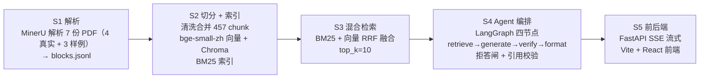

# 机械设备运维知识问答 RAG 平台

一个面向设备维修手册的检索增强生成（RAG）问答系统。把厂商 PDF 手册接入「解析 → 清洗切分 → 向量/BM25 索引 → 混合检索 → Agent 编排 → 流式问答」全链路，前端流式输出答案，并对知识库覆盖不到的问题显式拒答、对生成答案做引用校验以避免幻觉。全程本地离线加载模型，开发环境使用，不上生产。

> 本仓库由早期的液压系统时序预测性维护项目演化而来（阶段一～五记录于 [docs/process_log.md](docs/process_log.md)），当前主线为 S1–S5 的手册 RAG 管线。

## 使用场景

现场维修人员遇到设备故障时，通常要翻几百页 PDF 手册才能找到某个参数或处置步骤；本系统把这个过程变成一次提问。

- 「防爆泵安装需遵守哪些指导原则？」→ 返回正文段落
- 「出水管径125时轴封水量是多少？」→ 返回表格
- 「挖掘机液压泵压力多少正常？」→ 拒答（超出已导入手册范围）

知识库覆盖 7 个文档：4 份公开泵类手册 + 3 份自造样例手册（见「数据来源」），超出范围会显式拒答而不是猜测。

## 架构



## 核心数据

- **语料**：7 个文档 → 457 个 chunk（text 328 / table 129）：4 份公开泵类手册（439 条）+ 3 份自造样例手册（18 条，S1 阶段用于打通解析流程后保留在库）
- **评测集**：36 题（easy 14 / medium 17 / hard 5；text 29 / table 7），全部抽自真实手册 doc 1–4，不含 sample，故检索指标不受样例数据影响
- **三轮检索对比**（36 题，top_k=10，最终采用混合检索）：

| 指标 | 基线（纯向量） | 混合（BM25+向量） | 混合 + rerank | 最终采用 |
| --- | --- | --- | --- | --- |
| Recall@1 | 0.583 | **0.778** | 0.639 | 混合 |
| Recall@10 | 0.944 | 0.944 | 0.972 | 混合 |
| MRR@10 | 0.720 | **0.836** | 0.765 | 混合 |

- **端到端性能**（[s5_perf 实测](eval/reports/s5_perf.md)）：LLM 生成占端到端 98.1%（均值 2600.5 / 2651.8ms），拒答路径均值 61.5ms，较正常路径每题省 2590ms

## 关键取舍

1. **混合检索采用**。BM25 + 向量 RRF 融合：总体 R@1 0.583→0.778（+0.194）、MRR@10 0.720→0.836，table 的 R@1 0.143→0.429（翻三倍）。BM25 的字面匹配补上「问题 → 精确片段 / 表头 / 数字」的信号。

2. **rerank 弃用**。全局 CrossEncoder 精排把总体 R@1 从 0.778 打到 0.639（−0.139）；虽把 hard R@10 0.60→0.80、table R@10 0.714→0.857，但 7 条正文题被降权、单题 +3.07s（36 题共 110.7s）。text 占 29/36，全局精排净亏，脚本保留、config 置 `enabled: false`。

3. **拒答阈值重叠**。拒答闸取向量 top-1 distance 的 τ=0.3567（正样本 P95），但负样本「挖掘机液压泵」distance 0.3347 已穿过阈值。语义邻近查询与正样本无清晰间隔，单一距离闸挡不住——按正样本 P95 取值并如实记录，不调参补救。

## 快速启动

环境要求：Python 3.11+（依赖见 [requirements.txt](requirements.txt)）、Node 18+。

```bash
# 1. 配置 LLM key：复制 .env.example 为 .env 并填入 key

# 2. 后端（FastAPI + SSE，端口 8000）
python -m uvicorn src.s5_app.api:app --host 127.0.0.1 --port 8000
# 或 python src/s5_app/api.py

# 3. 前端（Vite + React，端口 5173）
cd frontend
npm install
npm run dev        # /api 自动代理到 http://localhost:8000
```

接口：`GET /api/health`（健康检查）、`POST /api/ask`（SSE 流式问答）。

## 目录结构

```text
.
├── configs/config.yaml        # 所有路径与参数（脚本内禁止硬编码）
├── data/
│   ├── raw_pdf/               # 7 份 PDF：4 份真实手册（1.pdf–4.pdf）+ 3 份自造样例（sample_*）
│   ├── parsed_md/             # MinerU 解析产物（blocks.jsonl + 每本一目录）
│   └── chunks/                # chunks.jsonl + bm25_index.pkl
├── chroma_db/                 # Chroma 持久化向量库（equipment_manual，457 条）
├── models/                    # bge-small-zh-v1.5 / bge-reranker-base（不入仓库）
├── eval/
│   ├── qa_set.jsonl           # 36 题评测集
│   └── reports/               # s3_baseline / s3_hybrid / s3_rerank / s3_summary
├── src/
│   ├── s1_ingest/             # MinerU 解析 → 结构化 → 质检
│   ├── s2_index/              # 清洗 → 合并 chunk → 向量化
│   ├── s3_eval/               # 评测集 + 混合检索 + rerank
│   ├── s4_agent/              # LangGraph 编排 + 引用校验
│   ├── s5_app/                # FastAPI 后端（SSE）
│   └── llm_config.py          # DeepSeek 配置
├── frontend/                  # Vite + React + TS + Tailwind 前端
├── docs/process_log.md        # 过程失败日志
├── CLAUDE.md                  # 项目施工手册
└── requirements.txt
```

## 数据来源

语料为 4 份公开可获取的泵类设备厂商手册（doc 1–4），另有 3 份自造样例手册（见清单后说明）：

1. D型/MD型/DF型卧式多级离心泵安装使用说明书
2. Wilo—WR 系列多级离心泵
3. Leader 离心泵（Ecotronic / Ecojet / Ecoplus 系列）
4. Model 3700, API Type OH2 / ISO 13709 安装、运行与维护手册

另有 3 份自造样例手册：sample_cooler_manual / sample_pump_manual / sample_valve_manual，由 [src/s1_ingest/_make_sample_pdfs.py](src/s1_ingest/_make_sample_pdfs.py) 生成，内容为虚构示例，S1 阶段用于打通解析流程，建库时未剔除，同样已入库可被检索（18 条 chunk，详见 [docs/badcase.md](docs/badcase.md) 案例 7）。

**仅用于开发环境的检索/生成能力验证**，不用于生产或商业用途。embedding 与 LLM 模型均本地离线加载（`local_files_only=True`），运行时不联网下载。

## 文档索引

- [docs/process_log.md](docs/process_log.md)（开发过程与失败记录）
- [docs/badcase.md](docs/badcase.md)（已知缺陷与边界分析）
- [eval/reports/s3_summary.md](eval/reports/s3_summary.md)（检索评测总结）
- [eval/reports/s5_perf.md](eval/reports/s5_perf.md)（端到端性能与 Token 成本评测）
