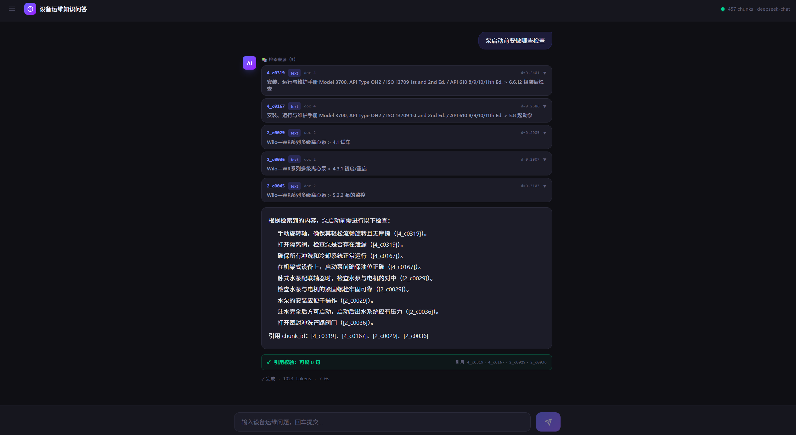
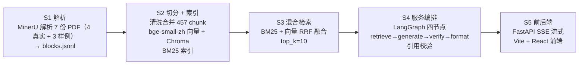

# 机械设备运维知识问答 RAG 平台

面向泵类设备维修手册的检索增强生成（RAG）问答系统：PDF 手册 → 解析切分 → 向量/BM25 混合检索 → 服务编排（retrieve → generate → verify → format）→ 流式问答，含拒答闸与逐句引用校验。全程本地离线加载模型，开发环境使用。

> 本仓库由早期的液压系统时序预测性维护项目演化而来（阶段一～五记录于 [docs/process_log.md](docs/process_log.md)），当前主线为 S1–S5 的手册 RAG 管线。

## 成果摘要

> 三条可量化结果，指标均可在 `eval/` 下复现。

- **混合检索选型**：Recall@1 0.583 → 0.778，MRR@10 0.720 → 0.836——BM25 的字面匹配补上了纯向量对表格/数字的弱召回（[s3_summary](eval/reports/s3_summary.md)）
- **幻觉抑制**：无引用句占比 A 1.000 → B 0.732 → C 0.063，仅改一行提示词条款；同期拒答率未上升（[halluc_ab](eval/halluc_ab/summary.md)）
- **拒答闸短路**：库外提问每题省约 2590 ms，LLM 生成占端到端 98.1%，拒答路径跳过全部生成与校验（[s5_perf](eval/reports/s5_perf.md)）

## 演示

<p align="center">
  
</p>

> 提问后先推送检索到的手册来源，再流式输出带 chunk_id 标注的答案，最后展示引用校验结果。

## 使用场景

> 谁会用、怎么用。

现场维修人员遇到设备故障时，通常要翻几百页 PDF 手册才能找到某个参数或处置步骤；本系统把这个过程变成一次提问。

- 「防爆泵安装需遵守哪些指导原则？」→ 返回正文段落
- 「出水管径125时轴封水量是多少？」→ 返回表格
- 「挖掘机液压泵压力多少正常？」→ 拒答（超出已导入手册范围）

知识库覆盖 7 个文档：4 份公开泵类手册 + 3 份自造样例手册（见「数据来源」），超出范围会显式拒答而不是猜测。

## 架构

> 五阶段数据流与拒答短路机制。



**拒答闸**是检索后的独立短路机制，不属于四节点流水线：检索完成后取向量 top-1 distance 与阈值 τ=0.3567（正样本 P95）比较，超阈值则直接返回「知识库无相关内容」，跳过 generate / verify / format 三段，省去全部 LLM 调用。

## 核心数据

> 语料规模、评测集构成与三轮检索对比。

- **语料**：7 个文档 → 457 个 chunk（text 328 / table 129）：4 份公开泵类手册（439 条）+ 3 份自造样例手册（18 条，S1 阶段用于打通解析流程后保留在库）
- **评测集**：36 题（easy 14 / medium 17 / hard 5；text 29 / table 7），全部抽自真实手册 doc 1–4，不含 sample，故检索指标不受样例数据影响
- **三轮检索对比**（36 题，top_k=10，最终采用混合检索）：

| 指标 | 基线（纯向量） | 混合（BM25+向量） | 混合 + rerank | 最终采用 |
| --- | --- | --- | --- | --- |
| Recall@1 | 0.583 | **0.778** | 0.639 | 混合 |
| Recall@10 | 0.944 | 0.944 | 0.972 | 混合 |
| MRR@10 | 0.720 | **0.836** | 0.765 | 混合 |

- **端到端性能**（[s5_perf 实测](eval/reports/s5_perf.md)）：LLM 生成占端到端 98.1%（均值 2600.5 / 2651.8 ms），拒答路径均值 61.5 ms，较正常路径每题省 2590 ms

## 幻觉抑制：三组对照实验

> 验证「哪种提示词能有效减少无依据输出」，同时排除「靠多拒答换引用率」的伪改善。

### 实验设计

三组系统提示词仅差一行条款，其余配置（LLM、temperature=0.0、top_k=5、检索缓存）完全相同：

| 组别 | 提示词差异 | 文件 |
|---|---|---|
| A | 无引用标注要求（弱约束基线） | `configs/prompt_weak_ab.txt`（删除引用条款） |
| B | 「答案末尾必须标注引用的 chunk_id」（原线上默认） | 线上系统提示词 |
| C | 「答案每一句末尾必须标注所引用的 chunk_id」 | `configs/prompt_per_sentence_c.txt` |

三组共用同一份落盘检索缓存（36 题，top_k=5），保证检索输入完全一致，只换系统提示词。

对照实验固定 top_k=5（检索选型评测用 top_k=10），因本实验只考察引用行为而非召回能力，收窄上下文可降低无关 chunk 带来的噪声干扰。

### 结果

| 组别 | 可打分题 | 实质句数 | 无引用句数 | 无引用句占比 | 拒答（闸/自述） | 拒答率 |
|---|---|---|---|---|---|---|
| A（弱约束） | 33 | 133 | 133 | **1.000** | 2 / 1 | 0.083 |
| B（末尾标注） | 33 | 149 | 109 | **0.732** | 2 / 1 | 0.083 |
| C（逐句标注） | 34 | 126 | 8 | **0.063** | 2 / 0 | 0.056 |

> 「可打分题」指模型给出了实质性答案的题目；触发拒答闸或自述「检索内容不足」的题目不进入句级统计，故三组分母略有差异。无引用句占比为组内自比（无引用句数 ÷ 实质句数），不受分母差异影响。

### 关键归因

- **B 组残留 0.732 的根因**：B 组提示词要求「答案末尾统一标注」，而评测口径按「句内或句尾含 chunk_id 标记」判定——两者天然错配，导致大部分句子被判为「无引用」。这不是模型不服从指令，而是提示词条款与校验器口径不一致。
- **C 组即修正口径的对照变体**：将「末尾统一标注」改为「每一句末尾必须标注」后，无引用句占比从 0.732 降到 0.063（Δ −0.668）。

### 为什么同时看拒答率

拒答率是控制变量：若某组「引用率改善」是靠少答换来的，则拒答率应同步上升。实测三组拒答率为 0.083 / 0.083 / 0.056——B 与 A 持平，C 比 A 低 2.7 个百分点，确认改善不来自「少答」。

> **线上默认已切到 C 组（逐句标注）提示词**，对应文件 [`configs/prompt_per_sentence_c.txt`](configs/prompt_per_sentence_c.txt)。

## 关键取舍

> 每个技术决策的依据与代价。

1. **混合检索采用**。BM25 + 向量 RRF 融合：总体 R@1 0.583→0.778（+0.194）、MRR@10 0.720→0.836，table 的 R@1 0.143→0.429（翻三倍）。BM25 的字面匹配补上「问题 → 精确片段 / 表头 / 数字」的信号。

2. **rerank 弃用**。全局 CrossEncoder 精排把总体 R@1 从 0.778 打到 0.639（−0.139）；虽把 hard R@10 0.60→0.80、table R@10 0.714→0.857，但 7 条正文题被降权、单题 +3.07 s（36 题共 110.7 s）。text 占 29/36，全局精排净亏，脚本保留、config 置 `enabled: false`。

3. **拒答阈值重叠**。拒答闸取向量 top-1 distance 的 τ=0.3567（正样本 P95），但负样本「挖掘机液压泵」distance 0.3347 已穿过阈值。语义邻近查询与正样本无清晰间隔，单一距离闸挡不住——按正样本 P95 取值并如实记录，不调参补救。

4. **bad case 与数据诚实性**。457 chunk 中有 18 条来自 S1 阶段自造样例手册，属于数据混入；评测集 36 题全部抽自真实手册 doc 1–4，因此检索指标不受影响。**选择如实记录而非清洗**，理由是重建索引（Chroma + BM25 全量重建 + 重跑三方评测）成本高于收益。另有一个 token 异常单例：qa_031 同时召回 5 个大表格 chunk，输入 token 10118，约为正常值 10 倍，已记录在 [`docs/badcase.md`](docs/badcase.md) 案例 9。

## 快速启动

> 三步跑通本地环境。

环境要求：Python 3.11+（依赖见 [requirements.txt](requirements.txt)）、Node 18+。

```bash
# 1. 配置 LLM key：复制 .env.example 为 .env 并填入 key

# 2. 后端（FastAPI + SSE，端口 8000）
python -m uvicorn src.s5_app.api:app --host 127.0.0.1 --port 8000
# 或 python src/s5_app/api.py

# 3. 前端（Vite + React，端口 5173）
cd frontend
npm install
npm run dev        # /api 自动代理到 http://localhost:8000
```

接口：`GET /api/health`（健康检查）、`POST /api/ask`（SSE 流式问答）。

## 目录结构

> 文件组织与各模块职责。

```text
.
├── configs/config.yaml        # 所有路径与参数（脚本内禁止硬编码）
├── data/
│   ├── raw_pdf/               # 7 份 PDF：4 份真实手册（1.pdf–4.pdf）+ 3 份自造样例（sample_*）
│   ├── parsed_md/             # MinerU 解析产物（blocks.jsonl + 每本一目录）
│   └── chunks/                # chunks.jsonl + bm25_index.pkl
├── chroma_db/                 # Chroma 持久化向量库（equipment_manual，457 条）
├── models/                    # bge-small-zh-v1.5 / bge-reranker-base（不入仓库）
├── eval/
│   ├── qa_set.jsonl           # 36 题评测集
│   ├── reports/               # s3_baseline / s3_hybrid / s3_rerank / s3_summary / s5_perf
│   └── halluc_ab/             # 幻觉抑制 A/B/C 三组对照实验产物
├── src/
│   ├── s1_ingest/             # MinerU 解析 → 结构化 → 质检
│   ├── s2_index/              # 清洗 → 合并 chunk → 向量化
│   ├── s3_eval/               # 评测集 + 混合检索 + rerank
│   ├── s4_agent/              # LangGraph 服务编排 + 引用校验
│   ├── s4_eval/               # 幻觉抑制对照评测脚本
│   ├── s5_app/                # FastAPI 后端（SSE）
│   ├── s5_eval/               # 端到端性能基准脚本
│   └── llm_config.py          # DeepSeek 配置
├── frontend/                  # Vite + React + TS + Tailwind 前端
├── docs/
│   ├── process_log.md         # 开发过程与失败记录
│   └── badcase.md             # 已知缺陷与边界分析
├── CLAUDE.md                  # 项目施工手册
└── requirements.txt
```

## 数据来源

> 语料构成与使用限制。

语料为 4 份公开可获取的泵类设备厂商手册（doc 1–4），另有 3 份自造样例手册（见清单后说明）：

1. D型/MD型/DF型卧式多级离心泵安装使用说明书
2. Wilo—WR 系列多级离心泵
3. Leader 离心泵（Ecotronic / Ecojet / Ecoplus 系列）
4. Model 3700, API Type OH2 / ISO 13709 安装、运行与维护手册

另有 3 份自造样例手册：sample_cooler_manual / sample_pump_manual / sample_valve_manual，由 [src/s1_ingest/_make_sample_pdfs.py](src/s1_ingest/_make_sample_pdfs.py) 生成，内容为虚构示例，S1 阶段用于打通解析流程，建库时未剔除，同样已入库可被检索（18 条 chunk，详见 [docs/badcase.md](docs/badcase.md) 案例 7）。

**仅用于开发环境的检索/生成能力验证**，不用于生产或商业用途。embedding 与 LLM 模型均本地离线加载（`local_files_only=True`），运行时不联网下载。

## 已知局限

> 未解决的问题与适用边界，诚实列出而非回避。

- **误拒率约 5.6%**（2/36）：按正样本 P95 取阈值的预期代价，属主动取舍——降低阈值会同时放大库外问题的漏拒
- **单一向量距离闸挡不住语义邻近的库外问题**：负样本 distance 0.3347 已穿过 τ=0.3567（详见关键取舍第 3 条）
- **仅本地离线开发环境验证**：未做并发压测与生产部署，SSE 流式在高并发下的稳定性未知
- **知识库仅覆盖泵类设备**：4 份真实手册 + 3 份样例，跨品类泛化能力未验证
