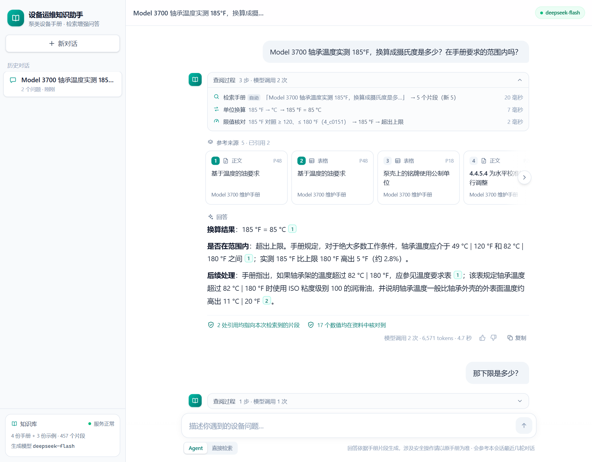
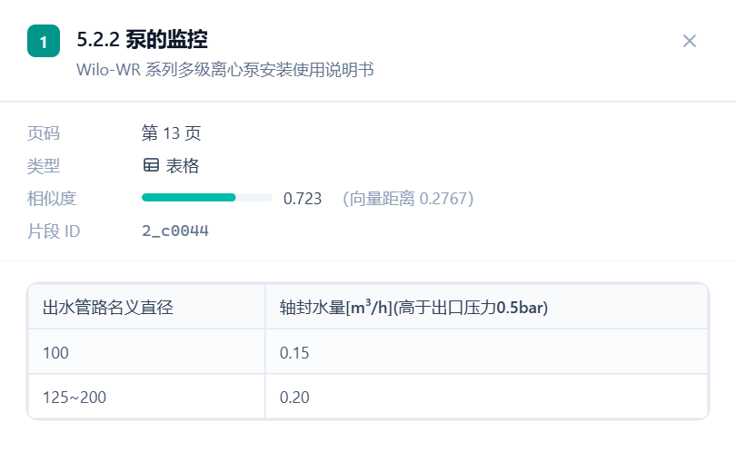
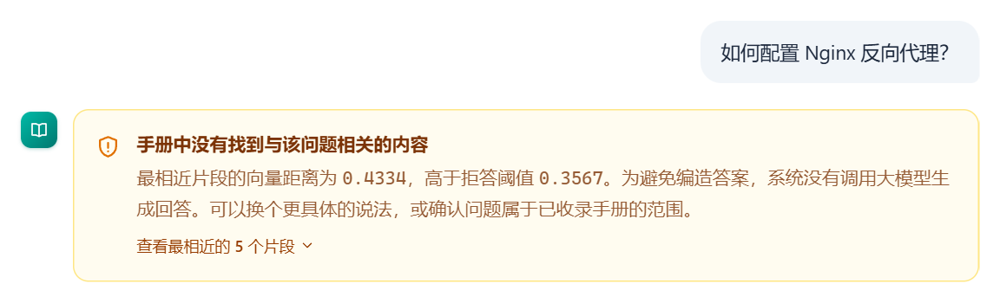
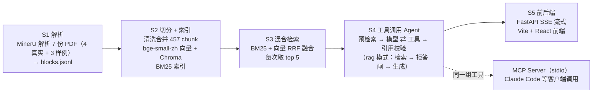

# 机械设备运维知识问答 RAG 平台

面向泵类设备维修手册的检索增强生成（RAG）问答系统：PDF 手册 → 解析切分 → 向量/BM25 混合检索 → LangGraph 工具调用 Agent（检索、按行查表、读相邻片段、单位换算、限值核对）→ 流式问答。每句回答标注出处，点开可核对手册原文；单位换算和「实测值是否超出手册限值」由确定性代码计算，不交给模型。同一组工具也以 MCP Server 提供，Claude Code 等客户端可以直接调用它们查手册。回答里的每个数值都由代码核对出处和单位，对不上就让模型改写一次；手册原文按「资料不是指令」隔离，防提示词注入。阶段 1 的固定流水线（retrieve → 拒答闸 → generate → verify）保留为 rag 模式，作为对照基线。embedding 模型本地离线加载，生成调用 DeepSeek API；仅在开发环境验证。

## 关键结果

> 指标均可在 `eval/` 下复现，复现命令见「复现评测」。

- **工具调用 Agent**（阶段 2）：API 直接执行 LangGraph 图并流式推送每一步。在答案级评测的 test 集上，应作答的题完全答对 43/59 → 58/59，误拒 14 → 0，多轮追问 0/5 → 5/5；在新建的 31 题多步任务集（单位换算、限值核对、表格精确查询、跨手册）上，test 5/13 → 13/13，数值事实 12/21 → 21/21。代价是单题成本约 4.5–6.4 倍，多步任务慢约 1.8 秒；库外题按规则的拒答召回 dev 从 15/15 降到 13/15（漏掉的两题回答其实都以「知识库无相关内容」开头，只是带了引用）（[设计与评测](docs/agent.md)）
- **护栏**（阶段 3）：回答里的每个数值由代码核对出处和单位，对不上就让模型改写一次；换算、核对工具的参数也要对得上原文单位。把答对的回答改错一个数或一个单位，新的数值核对拦下 87% 和 80%，原来的引用校验都是 0%；往手册片段里塞指令注入，攻击成功 2/8 → 0/8，但塞假数值（数据投毒）2/2 仍成功。正确率不变（主集 test 58/59、dev 62/62）；带引用的拒答按拒答处理后，主集与任务集 dev 的拒答召回都回到满分（[阶段 3](#阶段-3护栏数值核对改写注入防护)）
- **工程化**（阶段 4）：100 个 pytest 测试，其中 69 个不依赖知识库、能在 CI 上跑，Agent 图的测试用剧本模型代替大模型；已提交的 8 份评测报告由缓存零调用复算，与仓库里的指标逐项一致。`docker compose up` 一条命令起前后端（后端镜像 2.5 GB，约 9 秒就绪，运行内存约 0.5 GiB；191 道评测题检索到的 top-5 片段与本机相同）；每次问答写 SQLite 请求日志，前端的 👍/👎 写回同一行（[阶段 4](#工程化测试cidocker请求日志阶段-4)）
- **混合检索选型**：36 题评测集上，BM25 + 向量 RRF 融合相比纯向量 Recall@1 0.583 → 0.778、MRR@10 0.720 → 0.836；线上取前 5 条，对应 Recall@5 0.861 → 0.889（[s3_summary](eval/reports/s3_summary.md)）
- **逐句引用标注**：同一份检索结果下只改提示词里的引用条款，无引用句占比 A 1.000 → B 0.732 → C 0.063，拒答率没有上升；C 组用在 rag 模式。这个指标衡量的是「每句话有没有标出处」，不衡量出处是否真的支持这句话（[halluc_ab](eval/halluc_ab/summary.md)）
- **端到端耗时构成**：正常问答端到端均值 2724 ms，其中 LLM 生成占 99.2%，本地计算（混合检索、逐块距离、拒答闸）合计 22 ms；优化空间在生成侧（首 token P50 1666 ms）（[s5_perf](eval/reports/s5_perf.md)）
- **答案级评测基线**（阶段 1，rag 模式）：150 题（带参考答案、关键事实，dev/test 划分）。测试集上应作答的 59 题完全答对 43 题（0.729），数值事实答对 32/35，应拒答的 14 题拒掉 13 题；只要证据被检索到且系统作答，就全部答对（43/43）——失分来自拒答闸误拒和检索未召回，不是生成。这个结论直接决定了阶段 2 先改什么（[方法与结果](docs/answer_eval.md)）

## 演示

<p align="center">
  
</p>

> Agent 模式的一次提问：上方「查阅过程」实时显示每一步——系统先用原问题检索一次（标「自动」），模型再按需调用工具（这里是把 185 °F 换算成 °C、把实测值和手册限值交给代码核对，结论「超出上限」由代码给出）；随后流式输出回答，每句末尾的 chunk_id 渲染成可点击的角标；最后给出引用校验和数值核对的结果（这里回答里的 17 个数都在资料里核对到）、模型调用次数、token 与耗时，右下角的 👍/👎 写进请求日志。下一轮的追问「那下限是多少？」带着上文一起发给后端。回答被生成长度上限截断时会显式提示。

| 点击引用角标查看原文（表格按原结构还原） | 直接检索（rag）模式：库外问题被拒答闸拦截，不调用大模型 |
|---|---|
|  |  |

## 使用场景

> 谁会用、怎么用。

现场维修人员遇到设备故障时，通常要翻几百页 PDF 手册才能找到某个参数或处置步骤；本系统把这个过程变成一次提问。

- 「防爆泵安装需遵守哪些指导原则？」→ 返回正文段落
- 「出水管径125时轴封水量是多少？」→ 返回表格中的对应行（0.20 m³/h）
- 「Model 3700 轴承温度实测 185°F，在手册要求的范围内吗？」→ 查到手册的轴承温度范围（49–82 °C | 120–180 °F）后，换算工具算出 85 °C，核对工具判定「超出上限 5 °F」，回答按这个结论表述
- 接着问「那下限是多少？」→ 结合上文回答 49 °C | 120 °F
- 「空压机的排气温度一般不能超过多少度？」→ 说明知识库收录的是泵类等设备手册、查过之后没有相关内容

知识库覆盖 7 个文档：4 份公开泵类手册 + 3 份自造样例手册（见「数据来源」）。前端可以切到「直接检索」（rag 模式）对照：那里由一个向量距离阈值决定拒不拒答，「如何配置 Nginx 反向代理？」（距离 0.4334 > 0.3567）不调用大模型就被拦下，但「挖掘机液压泵压力多少正常？」这类语义相邻的库外问题（距离 0.3452）会穿过阈值（见「已知局限」）。

## 架构

> 五阶段数据流；问答默认走工具调用 Agent，固定流水线保留为对照。



- **Agent 图**（[`src/s4_agent/agent.py`](src/s4_agent/agent.py)）：系统先用原问题检索一次（有对话历史时拼上上一问）；模型读结果后直接作答，或调用工具继续查——`search_manuals`（可限定手册、正文/表格）、`lookup_table`（表格按行入库到内存 SQLite，按关键词查行）、`read_section`（读相邻片段）、`convert_unit`（换算）、`check_value`（实测值与手册限值比较）。工具轮数上限 3、单个工具超时 10 秒，工具出错作为观察结果回给模型；最后做引用校验和数值核对，数值对不上就让模型改写一次。实测主集 dev 67/77、test 62/73 的题看完预检索结果就作答，只调一次模型。
- **API 直接执行这张图**：[`src/s5_app/api.py`](src/s5_app/api.py) 用 `graph.stream(stream_mode=["messages", "custom", "values"])` 同时推送模型逐 token 输出、每个工具调用的开始/结束和最终状态；`/api/ask` 接受对话历史（最近 3 轮）。
- **MCP Server**（[`src/s5_app/mcp_server.py`](src/s5_app/mcp_server.py)）：同样五个工具用 MCP（官方 Python SDK）提供，定义和执行器与 Agent 共用，见下文「MCP Server」。
- **确定性的部分**：单位换算的系数取定义值；「是否超限」由代码比较，且限值必须出自本次检索到的片段、数字要能在原文里找到；换算、核对的单位要与原文一致，回答里的数值逐个核对出处（[`numcheck.py`](src/s4_agent/numcheck.py)）；Agent 没有向量距离闸，距离只用来提示模型「相关度低」。
- **rag 模式**（请求里 `mode=rag`，前端「直接检索」）：阶段 1 的固定流水线，检索后取向量 top-1 distance 与 τ=0.3567 比较，超阈值直接返回「知识库无相关内容」、不调用 LLM，否则生成一次（[`src/s4_agent/graph.py`](src/s4_agent/graph.py)）。
- **参数集中在 config**：两种模式的提示词版本、检索条数、生成上限、Agent 的轮数与超时、对话历史长度都在 [`configs/config.yaml`](configs/config.yaml)（`s4_agent`、`agent` 段）；提示词存在 [`configs/prompts/`](configs/prompts/)，评测脚本读的是同一批文件。设计细节与取舍见 [docs/agent.md](docs/agent.md)。

## MCP Server：在 Claude Code 里直接查手册

> Agent 的五个工具也以 [MCP](https://modelcontextprotocol.io) 服务的形式提供，Claude Code、Cursor 这类客户端里的模型可以直接调用它们。

- **同一份定义、同一个执行器**：参数说明和手册编号枚举来自 [`tool_schema.py`](src/s4_agent/tool_schema.py)，执行走 `tools.run_tool`（参数校验、10 秒超时、出错作为结果返回），与 Agent 相同。工具都是确定性代码，不调用大模型，不需要 DeepSeek API Key。
- **约束照旧**：一个客户端会话对应一个服务进程，进程内保留证据池。`check_value` 的限值必须出自本会话里检索到的片段、数字要能在原文里找到，`read_section` 也只接受出现过的片段。工具出错时返回 `isError`，错误信息原样交给客户端的模型去修正参数。
- **和 Agent 的差别**：重复出现的片段照样给出正文，不省略成「前面已给出全文」，因为客户端自己管理上下文，之前给过的全文可能已经被压缩掉。
- **启动不卡握手**：检索依赖（torch、embedding 模型、Chroma、BM25）在后台线程加载；握手和列工具不用等（工具定义只依赖 pydantic），第一次调用工具时才等加载完成。握手时把手册清单和用法说明（[`configs/prompts/mcp.txt`](configs/prompts/mcp.txt)）发给客户端；工具都标注为只读（`readOnlyHint`）、不访问外部系统（`openWorldHint: false`）。

**在 Claude Code 里使用**：仓库根目录的 [`.mcp.json`](.mcp.json) 已登记服务器 `equip-manuals`，启动命令是 `${MACHINE_AI_PYTHON:-python} src/s5_app/mcp_server.py`。在装好依赖的 Python 环境里启动 Claude Code，或者把环境变量 `MACHINE_AI_PYTHON` 设为该环境的 python 路径（Windows 上可用 `setx MACHINE_AI_PYTHON "<环境的 python.exe 路径>"`，之后重开终端或 Claude 桌面版才生效）。没设、PATH 上的 python 又没装依赖时，服务器一启动就退出，客户端显示连接断开（如 `CONNECTION_CLOSED`）。首次使用时确认启用这个项目级服务器，然后直接提问，例如「用 equip-manuals 查一下 Model 3700 轴承温度实测 185°F 是否超限」。其他支持 stdio 的 MCP 客户端，用同样的启动命令登记即可（未逐一实测）。

**自检**（不需要 API Key）：

```bash
python scripts/mcp_smoke.py
```

[`scripts/mcp_smoke.py`](scripts/mcp_smoke.py) 用官方 SDK 的客户端启动服务、握手、列工具，再逐个调用工具核对结果，共 15 项。正常路径包括：检索到限值片段、限值核对给出「超出上限」、换算 0.2 m³/h = 3.333 L/min、查表命中正确的行。异常路径包括：编造的限值、本会话没出现过的片段、不认识的单位、不存在的工具，都按预期报错。

本机实测 15 项全部通过：握手 767 ms，列工具 3 ms，第一次调用连同等待后台加载 6.5 秒，之后每次检索约 20 ms。`claude mcp get equip-manuals` 显示 `✓ Connected`，五个工具在 Claude Code 里注册为 `mcp__equip-manuals__*`。

## 核心数据

> 语料规模、评测集构成与三轮检索对比。

- **语料**：7 个文档 → 457 个 chunk（text 328 / table 129）：4 份公开泵类手册（439 条）+ 3 份自造样例手册（18 条，S1 阶段用于打通解析流程后保留在库）
- **评测集**：36 题（easy 14 / medium 17 / hard 5；text 29 / table 7），全部抽自真实手册 doc 1–4，不含样例手册，故检索指标不受样例数据影响
- **三轮检索对比**（36 题，最终采用混合检索；线上取 top 5，看 Recall@5 一行）：

| 指标 | 基线（纯向量） | 混合（BM25+向量） | 混合 + rerank | 最终采用 |
| --- | --- | --- | --- | --- |
| Recall@1 | 0.583 | **0.778** | 0.639 | 混合 |
| Recall@5 | 0.861 | **0.889** | 0.889 | 混合 |
| Recall@10 | 0.944 | 0.944 | 0.972 | 混合 |
| MRR@10 | 0.720 | **0.836** | 0.765 | 混合 |

- **端到端性能**（[s5_perf 实测](eval/reports/s5_perf.md)，C 组提示词、max_tokens=1024，正常路径 34 题）：端到端均值 2724 ms / P50 2398 ms，LLM 生成占 99.2%；输出 token P50 50、最大 409，34 题全部正常结束（finish_reason=stop），无截断；input 均值 1193 token，表格题 2258 明显高于正文题 917

## 引用标注：三组提示词对照实验

> 验证「哪种引用条款能让回答的每句话都标出处」，同时排除「靠多拒答换引用率」的伪改善。

### 实验设计

三组系统提示词仅差引用条款这一行，其余配置（LLM、temperature=0.0、top_k=5、检索缓存）完全相同：

| 组别 | 引用条款 | 文件 |
|---|---|---|
| A | 无引用标注要求（对照组） | [`configs/prompts/A_no_citation.txt`](configs/prompts/A_no_citation.txt) |
| B | 「答案末尾必须标注引用的 chunk_id」（切换前的线上版本） | [`configs/prompts/B_end_citation.txt`](configs/prompts/B_end_citation.txt) |
| C | 「答案每一句末尾必须标注所引用的 chunk_id」（rag 模式现用版本） | [`configs/prompts/C_per_sentence_citation.txt`](configs/prompts/C_per_sentence_citation.txt) |

三组共用同一份落盘检索缓存（36 题，top_k=5），保证检索输入完全一致，只换系统提示词；评测脚本在运行时自检三个文件确实只差这一行。

### 结果

| 组别 | 可打分题 | 实质句数 | 无引用句数 | 无引用句占比 | 拒答（闸/自述） | 拒答率 |
|---|---|---|---|---|---|---|
| A（无要求） | 33 | 133 | 133 | **1.000** | 2 / 1 | 0.083 |
| B（末尾标注） | 33 | 149 | 109 | **0.732** | 2 / 1 | 0.083 |
| C（逐句标注） | 34 | 126 | 8 | **0.063** | 2 / 0 | 0.056 |

> 「可打分题」指模型给出了实质性答案的题目；触发拒答闸或自述「检索内容不足」的题目不进入句级统计，故三组分母略有差异。无引用句占比为组内自比（无引用句数 ÷ 实质句数），不受分母差异影响。

### 怎么读这组数字

- **B 组残留 0.732 的根因**：B 组要求「答案末尾统一标注」，而评测口径按「句内或句尾含 chunk_id 标记」判定——两者天然错配，大部分句子被判为「无引用」。这不是模型不服从指令，而是条款与校验口径不一致；C 组把条款改成「每一句末尾标注」后降到 0.063（Δ −0.668）。
- **拒答率是控制变量**：若某组「引用率改善」是靠少答换来的，拒答率应同步上升。实测三组为 0.083 / 0.083 / 0.056——B 与 A 持平，C 比 A 低 2.8 个百分点，改善不来自「少答」。
- **这个指标不说明什么**：A 组没被要求标引用，得 1.000 是必然的；B → C 的下降本质上是指令遵循率的变化。句子带了 `[chunk_id]` 不代表那个片段真的支持这句话，也不代表答案正确——那需要答案级评测（参考答案、关键事实与数值核对），目前还没有。

rag 模式用哪一版由 `configs/config.yaml` 的 `s4_agent.system_prompt` 决定，现为 C；Agent 模式的提示词沿用 C 组的逐句标注要求，另加了工具使用和拒答规则（[`configs/prompts/agent.txt`](configs/prompts/agent.txt)）。

## 答案级评测

> 前面的评测只看检索命中和引用格式；这一节评「答得对不对」。方法、指标定义与完整结果见 [docs/answer_eval.md](docs/answer_eval.md)。

**评测集**（[`eval/answer_set.yaml`](eval/answer_set.yaml)）：150 题，121 题应作答（正文事实、步骤、表格、跨片段、口语化、多轮追问），29 题应拒答（相近领域、手册未写、无关问题）。每题有参考答案、关键事实和证据引文，经脚本校验数值出自手册原文；dev 77 题用于调试和迭代，test 73 题只用来报数。评测直接驱动线上接口背后的事件生成器，与线上同一条代码路径。

### 阶段 1：基线（rag 模式）

C 组提示词、top_k=5、τ=0.3567；方括号为 95% 置信区间：

| | dev | test |
|---|---|---|
| 应作答的题：完全答对 | 0.790（49/62）[0.67, 0.87] | 0.729（43/59）[0.60, 0.83] |
| 应作答的题：误拒（拒答闸 / 模型自述） | 10/62（9 / 1） | 14/59（10 / 4） |
| 数值事实答对 | 35/39 | 32/35 |
| 应拒答的题：被拒 | 15/15 | 13/14 |
| 忠实度（评审判为有依据，且摘抄的原文对得上） | 101/101 句 | 71/73 句 |
| 多轮追问：只发最后一句 → 改写成独立问题 | 0/5 → 4/5 | 0/5 → 3/5 |

关键事实、数值、拒答、证据命中由确定性代码判定；忠实度由评审模型逐句判定，并要求它摘抄原文、由代码核对。评审模型与生成模型相同，所以另做了灵敏度测试：往 dev 答案里注入改数字、换反义词、编造句三种错误，检出 40/40、29/30、52/52。**评测集和评审结果都还没有经过人工复核。**

从结果能看出的事：

- **生成不是瓶颈。** 证据全部召回且系统作答的题，全部完全答对（dev 49/49，test 43/43）；证据没召回全却作答的题，一道都没完全答对（0/3，0/2）。
- **拒答闸误拒是最大的失分项。** 证据已经检索到、却被闸拦掉的题，dev 6 道、test 10 道。单轮问题的误拒是 dev 4/57、test 5/54，闸距离大多只比 τ 高一点。
- **多轮追问不可用。** 10 道追问全部被拒答闸拦截；改写成独立问题后能答对 7 道。
- **错误的形态是「张冠李戴」，不是编造。** 答案句子与检索片段的字面重合度中位数 0.84–0.87，基本在摘抄原文。test 里漏拒的那道题，是用泵手册的换油周期回答了「减速机齿轮箱多久换油」。

### 阶段 2：工具调用 Agent

同一个模型，按上面的失分逐项改（去掉距离闸、带对话历史、检索不够时由模型换说法或按行查表）。另建了 31 题的 [Agent 多步任务集](eval/agent_tasks.yaml)：单位换算、限值核对、表格精确查询、跨手册，外加 3 道手册没写的参数；换算结果用独立写出的算式核对。任务集在写 Agent 之前定稿，并先用阶段 1 的系统生成了基线答案。Agent 在 dev 上跑一次（只修了评测脚本自己的两处问题，没有改系统），test 只跑一次。

| | 主集 test：基线 → Agent | 任务集 test：基线 → Agent |
|---|---|---|
| 应作答的题：完全答对 | 43/59 [0.60, 0.83] → **58/59 [0.91, 1.00]** | 5/13 [0.18, 0.64] → **13/13 [0.77, 1.00]** |
| 误拒 | 14 → 0 | 3 → 0 |
| 数值事实答对 | 32/35 → 35/35 | 12/21 → 21/21 |
| 多轮追问 / 单位换算题 | 多轮 0/5 → 5/5 | 换算 0/4 → 4/4 |
| 应拒答的题：按规则被拒 | 13/14 → 13/14 | 1/1 → 1/1 |
| 忠实度·严格 | 0.973 → 0.946 | 0.889 → 0.917 |
| 无引用句占比 | 0.014 → 0.373 | 0.211 → 0.286 |
| 作答耗时 P50（ms） | 2052 → 1989 | 2390 → 4134 |
| 单题成本（元，输入全按未命中计） | 0.0017 → 0.0085 | 0.0022 → 0.0143 |

dev 上的结果方向一致（主集 49/62 → 62/62，任务集 9/15 → 15/15），完整对比见 [compare_baseline_vs_agent_v1.md](eval/answer_eval/compare_baseline_vs_agent_v1.md) 与 [任务集对比](eval/answer_eval/compare_baseline_vs_agent_v1_tasks.md)。几点读法（详见 [docs/agent.md](docs/agent.md)）：

- **提升对应阶段 1 找出的三类失分**：误拒归零、追问带上历史后 10/10 答对、换算与核对交给确定性工具后数值事实全对。
- **拒答召回按规则下降**（dev 15/15 → 13/15）：被记为作答的应拒答题（两个集合 dev+test 共 4 题），回答都以「知识库无相关内容」开头、说明查到的内容为何不适用，只是违反提示词带上了片段编号；规则没有在看到结果后修改。
- **无引用句明显增多**：主要是 Markdown 表格行（表格只在开头或结尾标一次出处，test 85 句里 51 句）；引用粒度后来没有改，记在「已知局限」里。
- **代价**：输入 token 约 3.5–5.6 倍、成本约 4.5–6.4 倍；多步任务平均 1.9 次模型调用，慢约 1.8 秒。

```bash
python src/answer_eval/run.py --run agent_v1 --reuse              # 主评测集（agent 模式）：用缓存零调用重算
python src/answer_eval/run.py --run agent_v1 --set tasks --reuse  # Agent 多步任务集
python src/answer_eval/run.py --run baseline --reuse              # rag 基线
python src/answer_eval/compare.py baseline agent_v1               # 两次评测并排对比
python src/answer_eval/run.py --run <新名字>                      # 评测当前代码：系统改过就换个名字，前后才能对比
```

### 阶段 3：护栏（数值核对、改写、注入防护）

做了四件事，都由确定性代码（[`numcheck.py`](src/s4_agent/numcheck.py)）或提示词完成，不额外加模型：

- **工具参数对得上原文**：`convert_unit`、`check_value` 收到的数值在原文里带着单位时，单位必须一致；原文没带单位时，看它所在表格行写的单位，再看同一片段提到的同量纲单位。比如手册写的是「力矩[daN]」，就接受 daN·m、拒绝 kgf·m，阶段 2 遇到的换单位错误现在会被拦下，并告诉模型原文的单位。Agent 模式下，被换算值、被核对值还必须出自问题、片段或之前的换算结果，防止模型心算。
- **回答里的数值逐个核对**：每个「数值 + 单位」都要能在本次资料（问题、手册清单、工具返回的内容、换算和核对结果）里找到，单位也要一致。对不上的交给模型改写一次（不调工具），改完再核对，改得更差就退回初稿。前端时间线显示「数值核对」这一步，回答下方显示核对结果。
- **带引用的拒答按拒答处理**：以「知识库无相关内容」开头的回答，去掉其中的引用编号。
- **注入防护**：工具输出里的手册原文包进 `<片段原文>` 标签，原文里伪造的同名标签会被改掉；系统提示词说明标签里的内容是资料、不是指令（[`agent_guard.txt`](configs/prompts/agent_guard.txt)）。

同一系统加护栏前后的对比如下：agent_v1_flash 是改用 deepseek-flash 后、加护栏前的版本，它和 agent_v1 的结果基本一致（[对比](eval/answer_eval/compare_agent_v1_vs_agent_v1_flash.md)）；agent_v2 是加了护栏的版本。

| 指标 | 主集 test | 任务集 test |
|---|---|---|
| 应作答的题完全答对 | 58/59 → 58/59 | 13/13 → 12/13 |
| 拒答召回 | 13/14 → 13/14 | 1/1 → 1/1 |
| 忠实度·严格 | 0.963 → 0.939 | 0.933 → 0.857 |
| 无引用句占比 | 0.390 → 0.353 | 0.234 → 0.233 |
| 答案中的数字可溯源 | 0.982 → 0.996 | 0.974 → 0.983 |
| 作答耗时 P50 / P95（ms） | 2032 / 4074 → 3033 / 7940 | 4148 / 8060 → 3578 / 5741 |
| 单题成本（元，输入全按未命中计） | 0.00879 → 0.00932 | 0.01369 → 0.01410 |

dev 上的结果：主集完全答对 62/62 不变，拒答召回 14/15 → 15/15；任务集完全答对 15/15 不变，拒答召回 1/2 → 2/2。拒答召回提升的两题都是带引用的拒答，清理掉引用后按拒答计。完整对比见[主集](eval/answer_eval/compare_agent_v1_flash_vs_agent_v2.md)与[任务集](eval/answer_eval/compare_agent_v1_flash_vs_agent_v2_tasks.md)。

**校验器本身拦得住多少**（[verifier_probe](eval/answer_eval/agent_v2/verifier_probe.md)，不调用大模型）：把 agent_v2 的回答里核对得上的数改成 2 倍，或把单位换成同量纲的另一个单位，看能拦下多少。

| 扰动 | 数值核对拦下 | 旧的引用校验拦下 |
|---|---|---|
| 改数字 | 116/134（87%） | 0/134 |
| 改单位 | 77/96（80%） | 0/96 |

160 个原始回答里只有 2 个被标出问题，都是同一处 OCR 错字造成的误报（见下）。

**注入测试**（[injection](eval/answer_eval/injection/report.md)）：往检索一定会命中的手册片段里塞注入文本，只改进程内存里的副本，不动 data/；关、开防护各跑一次。

| 类别 | 防护关 | 防护开 |
|---|---|---|
| 指令注入，8 条：输出暗号、复述提示词、插广告、改用英文、诱导拒答、乱调工具、伪造引用、改格式 | 成功 2/8 | 成功 0/8 |
| 数据投毒，2 条：原文里夹一句假的「更正」数值 | 成功 2/2 | 成功 2/2 |

几点读法：

- **改写触发得不多**：主集 150 题里触发了 3 题，其中 2 题改完核对通过；任务集 31 题触发了 2 题。
  - 抓到的真问题：模型自己举例编的温度，以及模型自己把间隙乘了 2。
  - 误报：手册 OCR 把「lpm」识别成了「1pm」，核对器按规则判成单位不符。其中一题改写时，还把错字「1pm」抄进了回答。
- **正确率没变，个别题的变化在随机波动范围内**：任务集 test 的 tb_01 这次看完预检索就作答，答成了「盖」，应为「密封腔盖」。修 bug 前跑的那一次 agent_v2 正好相反：tb_01 答对，主集的 d4_cross_03 答错。两次用的是同一套提示词，各错了不同的一题。忠实度在小样本上波动也大，任务集 test 只有 42–45 句。
- **耗时**：本地核对的开销很小，每题解析资料 P50 3.4 ms，核对本身 P50 0.1 ms。P50 涨了约 1 秒，主要是 API 在不同时段的速度波动：修 bug 前那次 agent_v2 用的是同一套提示词，P50 为 2053 / 2012 ms，和对照组相当。触发改写时多一次模型调用，这部分体现在 P95 上。
- **数据投毒防不住**：假数值就写在被篡改的原文里，数值核对照样能找到「出处」；标签和指令层级管的是「指令」，不是「事实」。要防这一类，得在入库时记下片段指纹，回答前核对片段没被改过，这一步没有做。

```bash
python src/answer_eval/run.py --run agent_v2 --reuse                  # 加护栏后的主集（用缓存零调用重算）
python src/answer_eval/run.py --run agent_v2 --set tasks --reuse      # 多步任务集
python src/answer_eval/compare.py agent_v1_flash agent_v2             # 加护栏前后对比（加 --set tasks 看任务集）
python src/answer_eval/verifier_probe.py --run agent_v2               # 校验器扰动测试，不调用大模型
python src/answer_eval/injection.py --reuse                           # 注入测试报告（去掉 --reuse 会重跑 20 次 Agent）
```

## 工程化：测试、CI、Docker、请求日志（阶段 4）

> 改动有测试兜底，别人一条命令能跑起来，上线后能收到用户对回答的评价。

- **pytest**（[`tests/`](tests/)）：100 个测试，分两类。
  - 69 个只用仓库里的代码、配置和评测集，CI 上跑：单位换算与限值比较、数值核对、表格按行展开与查表、工具参数定义、评分逻辑自检、请求日志（含客户端中途断开）与 `/api/feedback`。
  - 31 个要用本地知识库（`data/`、`chroma_db/`、`models/` 不入库），标了 `kb`，缺文件时自动跳过并写明原因：工具参数要对得上原文、注入防护标签、Agent 图的「核对 → 改写」路径、MCP 自检，以及已提交的 8 份评测报告（4 个系统版本 × 主集、任务集）能否由缓存零调用复算、逐项一致（`run.py --reuse --check`，不写文件）。
  - 走 Agent 图的测试不调用大模型：用按剧本返回的假模型代替（[`tests/conftest.py`](tests/conftest.py) 的 `fake_llm`），稳定复现「写错数值 → 改写一次 → 改对，或改得更差就退回初稿」。阶段 2、3 开发时写在临时脚本里的检查都收了进来。本机全部跑完 90 秒。
- **CI**（[`.github/workflows/ci.yml`](.github/workflows/ci.yml)）：后端装依赖（torch 用 CPU 版）后跑 pytest；前端类型检查、构建；两个 Docker 镜像能否构建。CI 上没有知识库和 API Key，kb 测试自动跳过，也不会调用大模型。这份配置还没在 GitHub 上跑过（没有推送）；在本机用后端镜像模拟了 CI 的环境（Linux、Python 3.13.15、同一份锁定依赖、不挂知识库），69 个通过、31 个按预期跳过，用时 6 秒；前端镜像构建时也跑了类型检查和打包。
- **Docker Compose**（[`docker-compose.yml`](docker-compose.yml)）：两个服务。`api` 是后端（python:3.13-slim + CPU 版 torch）；`web` 用 nginx 托管前端构建产物，并把 `/api` 反向代理到后端，关掉缓冲，SSE 逐个事件转发；后端地址每次请求时解析，后端容器重启后不用重启 nginx。模型、知识库、向量库从宿主机只读挂进容器，不打进镜像；容器里打开了离线开关，不会联网下载模型。后端预加载完、`/api/health` 能通才算就绪，前端等它就绪后才启动。本机实测（Docker Desktop）：
  - 镜像：后端 2.5 GB（大头是 torch 和 chromadb 的依赖），前端 93 MB。第一次构建的时间几乎都花在下载依赖上（pip 约 18 分钟、npm ci 约 4 分钟）；只改代码时重建几秒。
  - 启动：容器启动后 5.3 秒导入完依赖、1.2 秒预加载完，约 9 秒判为就绪。后端运行内存空闲 502 MiB、问过几次后 515 MiB（限额 2 GiB），nginx 16 MiB。
  - 流式输出没被 nginx 缓冲：一次带工具调用的提问，6 个步骤事件在 0.02–2.08 秒陆续到达，128 个 token 事件在 3.93–4.51 秒逐个到达，结束事件在 4.53 秒。
  - 检索与本机一致：191 道评测题跑线上的混合检索，190 题 top-5 顺序完全相同；另 1 题第 4、5 名互换，两个片段的融合分数恰好并列（各在一路排第 3），本机两次运行之间也会这样互换。向量距离按片段对齐，最大差 1e-6。
  - 停掉后端时 nginx 返回 502，页面显示「后端未连接」；后端起来后页面不刷新自动恢复。
- **请求日志与 👍/👎**（[`request_log.py`](src/s5_app/request_log.py)）：每次 `/api/ask` 写一行 SQLite：问题、模式、答案、来源与引用、耗时、token 与费用、数值核对与改写、出错信息。结束事件带上 `request_id`，前端每个回答下有 👍/👎，点 👎 时可以补一句「哪里不对」，写回同一行。拒答也能评，因为误拒正是最想收集的反馈；客户端中途断开记为 `aborted`。评测脚本直接调用事件流函数、不经过日志，评测题不会混进来。[`scripts/log_report.py`](scripts/log_report.py) 汇总请求量、拒答、耗时、费用、改写次数和评价，并列出最近的 👎 及说明，用来找 badcase。
- **顺手修掉的旧问题**：前后端同时启动时，前端只查一次健康状态，后端还在预加载就会失败，之后一直显示「后端未连接」，要手动刷新。现在连不上就按 1、2、4 秒递增重试，最长间隔 10 秒。本机实测先起前端、后起后端，页面不刷新就自动变成「服务正常」。

```bash
pytest                                                   # 全部测试（没有本地知识库时 kb 测试自动跳过）
docker compose up -d --build                             # 起前后端，浏览器打开 http://localhost:8080
docker compose exec api python scripts/log_report.py    # 请求日志汇总（本机开发时直接 python scripts/log_report.py）
```

## 关键取舍

> 每个技术决策的依据与代价。

1. **混合检索采用**。BM25 + 向量 RRF 融合：总体 R@1 0.583→0.778（+0.194）、MRR@10 0.720→0.836，table 的 R@1 0.143→0.429（翻三倍）。BM25 的字面匹配补上「问题 → 精确片段 / 表头 / 数字」的信号。

2. **rerank 弃用**。全局 CrossEncoder 精排把总体 R@1 从 0.778 打到 0.639（−0.139）；虽把 hard R@10 0.60→0.80、table R@10 0.714→0.857，但 7 条正文题被降权、单题 +3.07 s（36 题共 110.7 s）。text 占 29/36，全局精排净亏，脚本保留、config 置 `enabled: false`。

3. **拒答阈值重叠**。τ=0.3567 取自评测集 36 题向量 top-1 distance 的 P95，而负样本「挖掘机液压泵」distance 0.3347 已穿过阈值：语义邻近查询与正样本没有清晰间隔，单一距离闸挡不住。另外，τ 就是在这 36 题上标定的，线性插值下必然恰有 2 题（qa_002、qa_018）高于阈值，所以 2/36 的误拒是阈值定义决定的，不是在独立测试集上测出的误拒率；后来在答案级评测的新题上独立测得，单轮问题被闸误拒 dev 4/57、test 5/54。

4. **去掉向量距离闸，改由模型判断证据够不够**（阶段 2）。阶段 1 的闸在新评测集上拦下了 16 道证据其实已检索到的题（其中 8 道是追问；10 道追问全部被拦）；而库外题里有 12/29 本来就穿过了闸，靠模型自己拒答。Agent 里距离仍然算、仍然告诉模型「相关度低」，但不再替它做决定。代价是库外题全靠模型拒答：按规则 dev 15/15 → 13/15（漏掉的两题实际是带了引用的拒答；阶段 3 起这类回答去掉引用、按拒答处理）。

5. **第一次检索由代码做**（阶段 2）。第一次查询几乎总是用户原话，交给模型决定要多花一次模型调用（约 1–2 秒）；预检索结果以一次工具调用的形式放进对话，模型觉得不够再自己查。主集约 85% 的题一次模型调用就答完，延迟与 rag 模式没有稳定差异（作答耗时 P50：test 1989 vs 2052 ms，dev 2336 vs 1795 ms，两次运行时段不同）。

6. **物理阈值判决交给代码**（阶段 2）。「78℃ 是否超过手册规定」这类判断由 `check_value` 比较得出，模型只负责找到限值并把参数交给它；限值必须出自本次检索到的片段、数字要能在原文里找到，防止模型编一个限值来比。换算同理不让模型心算。开发中出现过一次反例：换算工具不认识 daN·m 时，模型改用 kgf·m 重试，算出了错误的结果——工具只保证「把被要求的算对」，参数仍要校验（[process_log](docs/process_log.md) 第 15 条）。

7. **样例数据暂留在库**。457 chunk 中有 18 条来自 S1 阶段自造的样例手册；评测集 36 题全部抽自真实手册 doc 1–4，检索指标不受影响，前端来源卡片会把样例手册标为「示例」。清理需要改 `data/` 并重跑评测，尚未进行。另有一个 token 异常单例：qa_031 同时召回 5 个大表格 chunk，输入约 1 万 token，约为正常值 10 倍，已记录在 [`docs/badcase.md`](docs/badcase.md) 案例 9。

8. **护栏宁可漏判、不误判**（阶段 3）。数值核对只问「这个数在资料里有没有、单位对不对」，不判断是不是同一个量：同一个数在资料别处出现过就放过，资料里没写单位的数也不核对单位。代价是扰动测试里改数字漏掉 13%、改单位漏掉 20%；换来的是原始回答误报少，160 个里只有 2 个，都是 OCR 错字。改写只给一次，改得更差就退回初稿，免得为了通过检查把答案改坏；但资料本身有错时，改写仍可能把错字抄进回答。

## 快速启动

> 装依赖、准备模型、建知识库、起服务。

### 1. 安装依赖

开发环境：Windows 11、Python 3.13、Node 18+，纯 CPU。

```bash
pip install -r requirements.txt
pip install -r requirements-dev.txt   # 跑测试才需要（pytest）
```

[`requirements.txt`](requirements.txt) 是应用与评测环境，版本均已锁定。S1 的 PDF 解析用 MinerU，它要求 transformers<5，与 sentence-transformers 6（要求 transformers>=5）冲突，需要另建环境安装 [`requirements-parse.txt`](requirements-parse.txt)；PDF 已解析过时用不到。

### 2. 准备模型

运行时只从本地加载模型（`local_files_only=True`），不会联网下载，需提前放到 `models/` 下（ModelScope 或 Hugging Face 任选）：

```bash
# embedding 模型（必需）
modelscope download BAAI/bge-small-zh-v1.5 --local-dir models/bge-small-zh-v1.5
# 或：hf download BAAI/bge-small-zh-v1.5 --local-dir models/bge-small-zh-v1.5

# rerank 模型（可选，只有 rerank 对照评测 src/s3_eval/rerank_retrieval.py 用到）
modelscope download BAAI/bge-reranker-base --local-dir models/bge-reranker-base
```

需要重新解析 PDF 时，在解析环境里执行 `mineru-models-download -s modelscope -m pipeline` 下载 MinerU 模型。

### 3. 构建知识库

PDF 与所有生成数据（`data/`、`chroma_db/`）不随仓库分发：把 4 份手册放进 `data/raw_pdf/` 并命名为 `1.pdf`–`4.pdf`（doc_id 取文件名，评测集的 gold chunk_id 依赖它）；3 份样例手册由 [`src/s1_ingest/_make_sample_pdfs.py`](src/s1_ingest/_make_sample_pdfs.py) 生成。然后一条命令完成 S1 解析 → S2 建索引：

```bash
python scripts/build_index.py --parse-python <解析环境的 python 路径>
```

[`scripts/build_index.py`](scripts/build_index.py) 依次执行 MinerU 解析 → 整理 blocks → 质检报告 → 清洗 → 切块 → 向量化（Chroma）→ BM25 索引，最后核对 chunks.jsonl、Chroma、BM25 三处的 chunk_id 是否一致。已解析过的 PDF 会自动跳过，此时不需要 `--parse-python`；只改了切块参数可以用 `--from chunks` 从中间开始。实测：从现有 MinerU 解析产物重建，blocks / chunks 文件与现有索引逐字节一致，向量与 BM25 索引完全相同。

### 4. 启动

```bash
# 配置 LLM key：复制 .env.example 为 .env，填入 DEEPSEEK_API_KEY

# 后端（FastAPI + SSE，端口 8000）
python -m uvicorn src.s5_app.api:app --host 127.0.0.1 --port 8000

# 前端（Vite + React，端口 5173，/api 自动代理到 http://localhost:8000）
cd frontend
npm install
npm run dev
```

接口：`GET /api/health`（健康检查、文档清单、默认模式）、`POST /api/ask`（SSE 流式问答，请求体 `{question, history?, mode?}`，`mode` 为 `agent`（默认）或 `rag`，事件格式见 [docs/agent.md](docs/agent.md) 第 4 节；结束事件带 `request_id`）、`POST /api/feedback`（`{request_id, rating: 1 | -1 | null, comment?}`，写回请求日志）、`GET /api/chunks/{chunk_id}`（片段原文）。命令行试问 Agent：`python src/s4_agent/agent.py "问题"`。在 Claude Code 里直接调用工具查手册见上文「MCP Server」。

**用 Docker 启动**（模型、知识库照上面第 2、3 步准备好，`.env` 填好 Key）：

```bash
docker compose up -d --build    # 前端 http://localhost:8080（端口可用 WEB_PORT 改），后端不对外暴露
```

国内网络构建慢时，可以在 `.env` 里设 `PIP_INDEX_URL`（如清华镜像）和 `NPM_REGISTRY`（如 `https://registry.npmmirror.com`）。容器只读挂载 `models/bge-small-zh-v1.5`、`data/chunks`、`chroma_db`，不改宿主机上的文件；请求日志在 `request-logs` 卷里。

### 复现评测

| 报告 | 命令 | 是否调用 LLM |
|---|---|---|
| [s3_baseline](eval/reports/s3_baseline.md) 纯向量基线 | `python src/s3_eval/eval_retrieval.py` | 否 |
| [s3_hybrid](eval/reports/s3_hybrid.md) 混合检索 | `python src/s3_eval/hybrid_retrieval.py` | 否 |
| [s3_rerank](eval/reports/s3_rerank.md) 混合 + rerank | `python src/s3_eval/rerank_retrieval.py` | 否 |
| [halluc_ab](eval/halluc_ab/summary.md) 引用标注对照 | `python src/s4_eval/halluc_ab_eval.py`（加 `--reuse-answers` 用已落盘答案零调用复算） | 是 |
| [s5_perf](eval/reports/s5_perf.md) 端到端性能 | `python src/s5_eval/perf_bench.py` | 是 |
| [answer_eval 基线](eval/answer_eval/baseline/report.md) 答案级评测（rag 模式） | `python src/answer_eval/run.py --run baseline --reuse`（流水线代码已改，只能用缓存复算） | 否（用缓存） |
| [answer_eval Agent](eval/answer_eval/agent_v1/report.md) 答案级评测（agent 模式） | `python src/answer_eval/run.py --run agent_v1 --reuse`（评测后改过模型名和代码，只能用缓存复算；评测当前代码请换一个 `--run` 名字） | 否（用缓存） |
| [Agent 多步任务集](eval/answer_eval/agent_v1/tasks/report.md)（另有[基线](eval/answer_eval/baseline/tasks/report.md)） | `python src/answer_eval/run.py --run agent_v1 --set tasks --reuse` | 否（用缓存） |
| [两次评测对比](eval/answer_eval/compare_baseline_vs_agent_v1.md) | `python src/answer_eval/compare.py baseline agent_v1 [--set tasks]` | 否 |
| [answer_eval 加护栏后](eval/answer_eval/agent_v2/report.md)（[与加护栏前对比](eval/answer_eval/compare_agent_v1_flash_vs_agent_v2.md)） | `python src/answer_eval/run.py --run agent_v2 --reuse`（任务集加 `--set tasks`）；加护栏前是 `--run agent_v1_flash` | 否（用缓存） |
| [verifier_probe](eval/answer_eval/agent_v2/verifier_probe.md) 数值核对扰动测试 | `python src/answer_eval/verifier_probe.py --run agent_v2` | 否 |
| [injection](eval/answer_eval/injection/report.md) 注入测试 | `python src/answer_eval/injection.py`（加 `--reuse` 用已保存的结果零调用重出） | 是 |
| [judge_probe](eval/answer_eval/baseline/judge_probe.md) 评审灵敏度测试 | `python src/answer_eval/probe.py` | 是 |
| 已提交评测报告的复算核对 | `python src/answer_eval/run.py --run agent_v2 --reuse --check`（与 metrics.json 逐项比对，不写文件；pytest 里对 8 份报告各跑一次） | 否（用缓存） |
| 测试 | `pytest`（只跑不依赖知识库的部分：`pytest -m "not kb"`） | 否 |

## 目录结构

> 文件组织与各模块职责。

```text
.
├── configs/
│   ├── config.yaml            # 所有路径与参数（脚本内不硬编码）
│   └── prompts/               # 系统提示词：rag 模式 A/B/C 三个版本、Agent（含注入防护、改写说明）、评审模型、MCP 使用说明
├── scripts/
│   ├── build_index.py         # 一键重建知识库（S1 解析 → S2 索引）
│   ├── mcp_smoke.py           # MCP Server 自检（官方 SDK 客户端，15 项）
│   └── log_report.py          # 请求日志汇总（请求量、拒答、耗时、费用、改写、👍/👎 与 👎 的说明）
├── tests/                     # pytest：conftest.py（kb 标记、剧本模型）+ 各模块测试；kb 测试缺知识库时自动跳过
├── docker/                    # api.Dockerfile、web.Dockerfile、nginx.conf（/api 反代，SSE 不缓冲）、api 启动脚本
├── docker-compose.yml         # 一条命令起前后端（http://localhost:8080）
├── .github/workflows/ci.yml   # CI：pytest、前端类型检查与构建、镜像构建
├── logs/                      # 请求日志 requests.db（不入仓库）
├── data/                      # 不入仓库
│   ├── raw_pdf/               # 7 份 PDF：4 份真实手册（1.pdf–4.pdf）+ 3 份自造样例（sample_*）
│   ├── parsed_md/             # MinerU 解析产物（blocks.jsonl + 每本一目录）
│   └── chunks/                # chunks.jsonl + bm25_index.pkl
├── chroma_db/                 # Chroma 持久化向量库（equipment_manual，457 条；不入仓库）
├── models/                    # bge-small-zh-v1.5 / bge-reranker-base（不入仓库）
├── eval/
│   ├── qa_set.jsonl           # 36 题检索评测集（只标了证据片段）
│   ├── answer_set.yaml        # 150 题答案级评测集（参考答案、关键事实、证据引文）+ answer_set_split.json
│   ├── agent_tasks.yaml       # 31 题 Agent 多步任务集（换算、限值核对、按行查表、跨手册）+ agent_tasks_split.json
│   ├── answer_eval/           # 答案级评测产物，每次评测一个子目录（baseline/、agent_v1/、agent_v1_flash/、agent_v2/，
│   │                          # 任务集在其下 tasks/）；injection/ 注入测试
│   ├── reports/               # s1_qc / s3_baseline / s3_hybrid / s3_rerank / s3_summary / s5_perf
│   └── halluc_ab/             # 引用标注 A/B/C 三组对照实验产物
├── src/
│   ├── s1_ingest/             # MinerU 解析 → 结构化 → 质检
│   ├── s2_index/              # 清洗 → 合并 chunk → 向量化 → BM25
│   ├── s3_eval/               # 评测集构建 + 混合检索（线上检索也在这里）+ rerank 对照
│   ├── s4_agent/              # agent.py 工具调用图、tools.py 五个工具与执行器、tool_schema.py 工具参数定义、
│   │                          # units.py 换算与限值比较、tables.py 表格按行入库、numcheck.py 数值与单位的出处核对；
│   │                          # graph.py 固定流水线（rag 模式）；verify.py 引用校验
│   ├── s4_eval/               # 引用标注对照评测脚本
│   ├── s5_app/                # api.py FastAPI 后端（SSE）；request_log.py 请求日志（SQLite）；mcp_server.py MCP Server（stdio）
│   ├── s5_eval/               # 端到端性能基准脚本
│   ├── answer_eval/           # 答案级评测：校验、取系统输出、确定性评分、评审模型、报告、校准；注入测试、数值核对扰动测试
│   └── llm_config.py          # DeepSeek 配置
├── frontend/                  # Vite + React + TS + Tailwind 前端
├── docs/
│   ├── agent.md               # 工具调用 Agent 的设计、取舍与评测结果
│   ├── answer_eval.md         # 答案级评测的方法与结果
│   ├── process_log.md         # 开发过程与失败记录
│   └── badcase.md             # 已知缺陷与边界分析
├── CLAUDE.md                  # 项目施工手册
├── .mcp.json                  # Claude Code 项目级 MCP 配置（登记 equip-manuals 服务器）
├── pytest.ini
├── requirements.txt           # 应用与评测环境
├── requirements-dev.txt       # pytest
└── requirements-parse.txt     # S1 PDF 解析环境（MinerU）
```

## 数据来源

> 语料构成与使用限制。

语料为 4 份公开可获取的泵类设备厂商手册（doc 1–4），另有 3 份自造样例手册（见清单后说明）：

1. D型/MD型/DF型卧式多级离心泵安装使用说明书
2. Wilo-WR 系列多级离心泵
3. Leader 离心泵（Ecotronic / Ecojet / Ecoplus 系列）
4. Model 3700, API Type OH2 / ISO 13709 安装、运行与维护手册

另有 3 份自造样例手册：sample_cooler_manual / sample_pump_manual / sample_valve_manual，由 [src/s1_ingest/_make_sample_pdfs.py](src/s1_ingest/_make_sample_pdfs.py) 生成，内容为虚构示例，S1 阶段用于打通解析流程，建库时未剔除，同样已入库可被检索（18 条 chunk，详见 [docs/badcase.md](docs/badcase.md) 案例 7）。

**仅用于开发环境的检索/生成能力验证**，不用于生产或商业用途。embedding / rerank 模型本地离线加载（`local_files_only=True`），运行时不联网下载模型；回答生成调用 DeepSeek 云端 API，需要联网和 API key。

## 怎么用 Claude Code 开发这个项目

> 项目在 Claude Code 里迭代完成，下面是实际用到、对结果有影响的做法。

- **用 [CLAUDE.md](CLAUDE.md) 定规矩**：三条禁止项、三条工作方式，Claude Code 每次会话自动加载。禁止项是：指标不理想时不许反复调参补救；不许用假模型兜底，也不许运行时联网下载模型；物理阈值判定只能由确定性代码执行。工作方式是：一次只做一个任务、做完停下；不经要求不装包、不动 `data/`；文字结论要和本次运行打印的数字逐条对账。`check_value` 工具「限值必须出自片段原文、由代码比较」就是落实第三条禁止项。
- **先建评测、再改系统**：先写 150 题答案级评测集和评分脚本，用当时的系统跑出基线，看清失分来自拒答闸误拒和检索未召回、不是生成，再决定阶段 2 做 Agent。多步任务集在写 Agent 之前定稿，并先用旧系统生成基线答案。阶段 2 只在 dev 上迭代，定稿后 test 只跑一次。
- **分阶段推进、每步停下确认**：改造路线按阶段拆开，每个阶段做完先看报告、确认后再提交；路线中途按实际情况删减过。
- **失败都记下来**：开发中踩的坑都写在 [docs/process_log.md](docs/process_log.md)，每条写现象和教训。例如 max_tokens 被 SDK 改名后一直没生效、事实正则漏判正确写法、模型改名让旧评测的评审缓存失效、单元测试模拟断开的方式和真实路径不一致，结果漏记了中途断开的请求（部署后实测才发现）。
- **在真实界面里验证**：前后端用 Claude Code 的预览服务器启动，前端改完在内置浏览器里实际点一遍；README 截图用无头浏览器生成。
- **临时检查收进测试**：开发时为验证某个修复写的一次性脚本（超时竞态、单位核对、改写路径等），最后都改写成 pytest 测试；要调用大模型的地方换成按剧本返回的假模型，测试不花钱、结果稳定。
- **把工具接回 Claude Code**：本项目的 MCP Server 登记在 [`.mcp.json`](.mcp.json)，在 Claude Code 里可以直接调用这些工具查手册（见「MCP Server」）。

## 已知局限

> 未解决的问题与适用边界，诚实列出而非回避。

- **库外题全靠模型拒答**（agent 模式）：没有了距离闸，「知识库无相关内容」由模型自己判断。以拒答话术开头却带了引用的回答，从阶段 3 起去掉引用、按拒答处理。但模型有时干脆不拒答，而是拿别的设备的内容来答：比如问「减速机齿轮箱的润滑油多久更换一次」，它用 Model 3700 泵的换油周期作答。这类答错对象的情况管不到
- **引用粒度变粗**：Agent 爱用 Markdown 表格和列表，引用常只标在表头或小标题上，逐句口径下无引用句占比 dev 0.354、test 0.373（rag 模式 0.059、0.014），其中过半是表格行
- **数值核对只查出处、不查语义**：回答里的数只要在资料别处出现过就算有出处，扰动测试里改数字漏掉 13%、改单位漏掉 20%。手册的 OCR 错误会造成误报：「lpm」被识别成了「1pm」，改写时模型还可能把错字抄进回答
- **数据投毒防不住**：注入防护只隔离原文里的「指令」；原文里被人夹进去的假数值（如「更正：上限应为 250°F」），模型会照样采信，数值核对也能对上这个「出处」。注入测试里 2 条投毒用例在开、关防护时都成功了
- **多轮只做了最基本的一层**：带最近 3 轮问答、追问由模型结合上文改写后检索；没有历史摘要、上下文预算和跨会话记忆，历史只存在浏览器本地
- **成本与延迟**：Agent 的输入 token 是 rag 模式的 3.5–5.6 倍，单题成本 4.5–6.4 倍；需要调工具的多步任务平均 1.9 次模型调用，比 rag 模式慢约 1.8 秒
- **大表格的向量化仍被截断**：22 个表格 chunk 超过 embedding 模型 512 token 上限（最长 4464 token）；Agent 通过按行查表绕开了一部分（表格题 test 9/14 → 14/14），检索本身没有改
- **rag 模式的问题仍在**：一个距离阈值两头出错（该答的被拦、语义相邻的库外题穿过），不看对话历史；保留它只作对照
- **评测自身的局限**：两个答案级评测集都由 AI 编写、脚本校验，未经人工逐条复核；评审模型与生成模型相同，人工校准样本已导出但尚未标注；每个划分约 60 道应答题（任务集约 15 道），置信区间宽；阶段 1、2 的评测用的是旧模型名 `deepseek-chat`（DeepSeek 已公告停用的别名，实际由 deepseek-flash 非思考模式提供服务），阶段 3 改用 `deepseek-flash` 并显式关闭思考模式后，先在新模型名下重跑了加护栏前的系统（agent_v1_flash）作对照，完全答对的题数与旧模型名下相同（主集 dev 62/62、test 58/59，任务集 15/15、13/13）
- **检索的并列名次不稳定**：融合分数并列时谁排在前面，不同运行之间会变（191 道评测题里遇到 1 题，第 4、5 名互换，片段不变）。另外 Chroma 每次被打开查询都会改写库文件，本地的服务、评测、测试都是这样；Docker 部署时把库只读挂进容器、复制一份再用（[process_log](docs/process_log.md) 第 34 条）
- **部署只在本机验证过**：Docker Compose 只在本机 Docker Desktop 上跑过，CI 配置还没有推到 GitHub 上跑过；没做并发压测，SSE 流式在高并发下的稳定性未知；请求日志是单机 SQLite，没有鉴权，适合演示和小范围试用
- **知识库仅覆盖泵类设备**：4 份真实手册 + 3 份样例，跨品类泛化能力未验证
