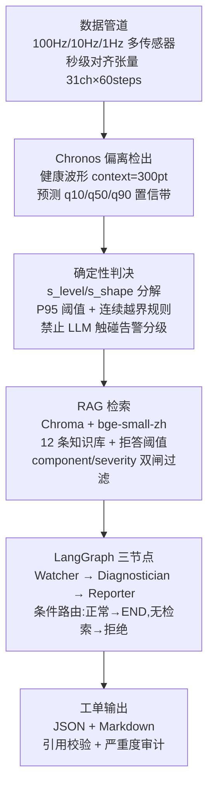

# 复杂流体动力装备预测性维护平台 — 基于时序基础模型的偏离检出与诊断闭环

液压系统冷却器/换向阀/液压泵/蓄能器四组件故障检测，Chronos-Bolt 零样本健康波形延拓 + 确定性物理判决 + LangGraph 三节点诊断闭环。

## 在线演示

Demo 链接：（部署后填写）

## 架构



## 核心结果

### 阶段一：GroupKFold 分组留出验证

| 组件 | RF Stratified | RF GroupKFold | 跌幅 | XGB Stratified | XGB GroupKFold | 跌幅 |
|---|---|---|---|---|---|---|
| Cooler | 1.0000 | 1.0000 | 0% | 1.0000 | 0.9993 | 0.07% |
| Valve | 0.9841 | 0.9381 | -4.63% | 0.9841 | 0.9409 | -4.34% |
| Pump | 0.9938 | 0.9878 | -0.60% | 0.9917 | 0.9764 | -1.53% |
| Acc | 0.9883 | 0.8731 | -11.65% | 0.9848 | 0.9114 | -7.43% |

随机分层显著高估模型能力，GroupKFold 分组留出揭示真实泛化差距。

### 阶段二：Cooler 偏离检出

| 指标 | 值 |
|---|---|
| 检出率 (故障窗口 A 类) | 1.0000 |
| 近距误报率 (同块健康 B 类) | 0.0000 |
| 远距误报率 (跨块健康 C 类) | 0.0667 |

### 三方对照：Chronos 分解法 / Naive last-value / 平凡均值法

| Method | A Detection | B FPR | C FPR |
|---|---|---|---|
| Chronos decomposition | 1.0000 | 0.0000 | 0.0667 |
| Naive last-value | 1.0000 | 0.0000 | 0.2333 |
| Trivial mean | 1.0000 | 0.0000 | 0.0667 |

**在 cooler 上，Chronos 未带来超出平凡均值法的任何增益。** 100% 检出完全来自 s_level（基线温度偏移），Chronos 的点预测精度（MAE 0.56°C）与 trivial 持平。

### Valve 五轮实验总表

| Method | A(73) | A(80) | A(90) | B FPR | C FPR | 失败原因 |
|---|---|---|---|---|---|---|
| Chronos ps1_mean | 0.00 | 0.00 | 0.00 | 0.00 | 0.10 | 通道受 cooler 主导，valve 信号≈0 |
| Chronos ps1_ptp | 0.60 | 0.00 | 0.00 | 0.67 | 1.00 | A/B/C s_level 分布完全重叠 |
| Chronos ps2_std | 0.00 | 0.00 | 0.00 | 0.00 | 0.00 | 预检通过但 Chronos 残差分离失败 |
| ΔP nearest | 0.00 | 0.00 | 0.00 | 0.00 | 0.00 | 阈值被 pump-crossing 配对的漂移挟持 |
| ΔP matched | 0.00 | 0.00 | 0.00 | 0.00 | 0.00 | accumulator 变化也推高 dp12 漂移 |
| ΔP systemic | 0.00 | 0.00 | 0.00 | 0.00 | 0.00 | acc=130↔{100,115} 残余 bimodal |

**valve 全部检测器检出率为零。** 根本原因：蓄能器档位跳变引起的 dp12 波动（0.87–0.90 bar）大于所有 valve 故障信号（0.20–0.83 bar），单通道无法分离。

## 诚实性声明

1. **Chronos 在 cooler 和 valve 上均未跑赢平凡均值基线。** cooler 上三类方法检出率完全一致；valve 上 Chronos 检出 60%（ps1_ptp）但 B 类误报 67%，无区分力。
2. **Valve 单通道检测因故障叠加而结构性不可行。** dp12 同时响应 valve 故障（0.20–0.83 bar）和 accumulator/pump 状态变化（0.17–1.03 bar），后者覆盖前者。
3. **RAG 拒答阈值留出验证为 4/6。** 语义邻近的查询（"冷却水塔风机"→cooler-02、"电磁阀线圈"→valve-03）会穿过阈值。τ_retrieval=0.62 不做调整，如实记录。
4. **知识库定量数字经过回溯审计。** 审计脚本 `tests/test_knowledge.py`，审计记录详见 [docs/process_log.md](docs/process_log.md) 条目 31–33。

## 快速启动

```bash
pip install -r requirements.txt       # 仅需 streamlit plotly numpy pandas
python src/build_rag.py               # 构建向量库（需 chromadb, sentence-transformers）
streamlit run app.py                  # 启动 Demo（无需原始数据，无需 GPU）
```

> 完整环境依赖见 `requirements.txt`（Demo 用 4 包）和 `CLAUDE.md`（开发用全量依赖）。

## 数据来源与许可

原始数据来自 UCI Machine Learning Repository：
- **名称**: Condition monitoring of hydraulic systems
- **DOI**: [10.24432/C5CW21](https://doi.org/10.24432/C5CW21)
- **许可**: [CC BY 4.0](https://creativecommons.org/licenses/by/4.0/)
- **引用**: Helwig, N., Pignanelli, E., & Schütze, A. (2018). Condition monitoring of hydraulic systems [Dataset]. UCI Machine Learning Repository.

因原始数据文件超过 GitHub 100 MB 限制，`dataset/` 不入仓库。Demo 使用预计算数据包 `app_data/demo_windows.npz`，无需下载原始数据。

## 目录结构

```
.
├── app.py                   Streamlit 交互 Demo
├── app_data/                预计算 Chronos 预测结果（1680 窗口）
├── data/                    秒级对齐张量 tensor_31ch_60steps.npz
├── dataset/                 原始 UCI 数据（不入仓库）
├── docs/                    过程记录与演示脚本
├── hydraulic_cleaning/      探索性分析 Notebook（8 个）
├── knowledge/               知识库 12 条排查条目（Markdown）
├── models/                  bge-small-zh-v1.5 嵌入模型（不入仓库）
├── output/                  LangGraph 运行工单与 State 快照
├── rag_store/               Chroma 向量库持久化（不入仓库）
├── reports/                 实验报告图表与 split_comparison.csv
├── src/                     核心代码
│   ├── agent_graph.py       LangGraph 三节点闭环
│   ├── build_rag.py         Chroma 向量库构建
│   ├── llm_config.py        LLM 后端（DeepSeek）
│   ├── query_rag.py         检索 + 拒答 + 严重度硬过滤
│   └── severity_map.py      确定性严重度分级
├── tests/                   test_knowledge.py + test_verifier.py
├── CLAUDE.md                项目施工手册
├── README.md                本文件
└── requirements.txt         运行 Demo 所需依赖
```

## 局限与下一步

- **Pump 与 Accumulator** 未做偏离检出。阶段二仅覆盖 cooler 与 valve，pump 无对应通道、accumulator 无物理传感器可直接监测预充压力。
- **分制度阈值标定**：当前 τ_level / τ_shape 对所有 cooler 档位共用一对阈值。按严重度分级建立独立阈值（轻度/中度/严重各一对 τ）是下一步的改进方向。
- **多组件联合诊断**：当前 LangGraph 闭环一次只诊断一个组件，系统级故障（如 system-01 排查流程）未接入自动化路径。
- **留出验证覆盖率**：τ_retrieval 留出验证 4/6 通过，2 例漏网均为语义邻近导致的向量近似。进一步扩大负样本集并标定多级阈值是改进方向。
